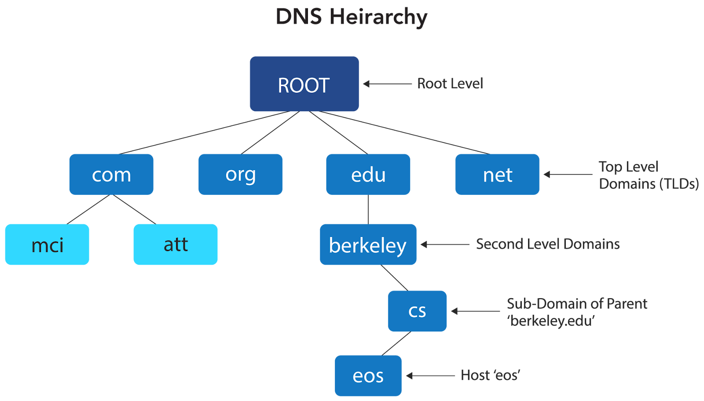
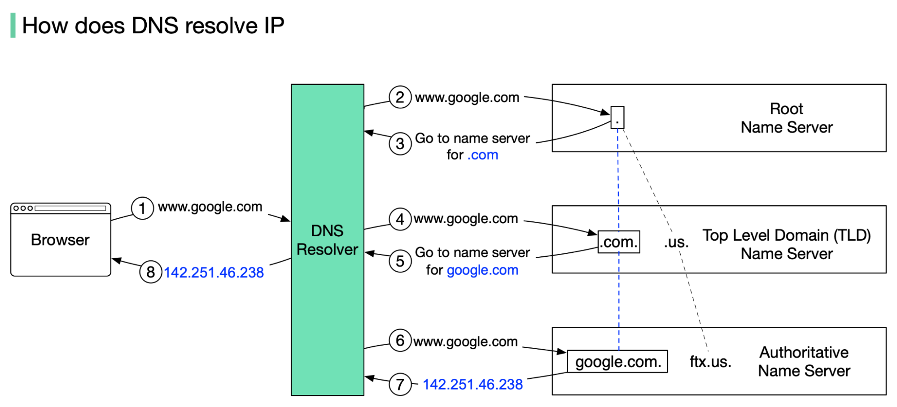

# DNS (Domain Name System)

## What is DNS?

**Definition:**  
The **Domain Name System (DNS)** is a **hierarchical, distributed naming system** that translates human-readable domain names (like `www.google.com`) into machine-readable **IP addresses** (like `142.250.192.46`).

It is often called the **"phone book of the Internet"** — instead of memorising IP addresses, users type domain names, and DNS handles the lookup behind the scenes.

**Protocol:** UDP/TCP on **Port 53**  
**Layer:** Application Layer (Layer 7)

**Why DNS is needed:**
- Humans remember names, not numbers.
- IP addresses can change; domain names remain stable.
- DNS enables load balancing, redundancy, and flexible infrastructure management.

---

## 1. DNS Hierarchy

DNS is organised as a **distributed, hierarchical tree** — no single server knows everything. Each level of the hierarchy is responsible for a part of the namespace.



### Levels of the Hierarchy

| Level | Name | Description | Example |
|-------|------|-------------|---------|
| **Level 0** | Root Zone | Top of the hierarchy; managed by IANA/ICANN; 13 root server clusters worldwide | `.` (the invisible trailing dot) |
| **Level 1** | Top-Level Domain (TLD) | Generic TLDs (gTLDs) and country-code TLDs (ccTLDs) | `.com`, `.org`, `.net`, `.in`, `.uk` |
| **Level 2** | Second-Level Domain | Organisation or brand registered with a registrar | `google`, `amazon`, `wikipedia` |
| **Level 3** | Subdomain | Further subdivisions managed by the domain owner | `www`, `mail`, `api`, `docs` |

**Fully Qualified Domain Name (FQDN):**
```
www.google.com.
│   │      │  └── Root (implied dot)
│   │      └───── TLD (.com)
│   └──────────── Second-level domain (google)
└──────────────── Subdomain (www)
```

---

## 2. DNS Components

### 2.1 DNS Resolver (Recursive Resolver)

**Definition:**  
The DNS Resolver is the client-side component (usually provided by the ISP or configured manually) that **accepts DNS queries from applications** and performs all the lookup work on their behalf.

**Key Points:**
* Also called a **Recursive Resolver** or **Full-Service Resolver**.
* Caches responses to reduce repeat queries.
* If it does not know the answer, it queries the root servers and follows the hierarchy.
* Common public resolvers: `8.8.8.8` (Google), `1.1.1.1` (Cloudflare), `9.9.9.9` (Quad9)

### 2.2 Root Name Servers

**Definition:**  
Root Name Servers are the top of the DNS hierarchy. They know the addresses of all TLD name servers.

**Key Points:**
* There are **13 logical root server addresses** (labelled A through M), operated by different organisations.
* Physically replicated globally using **Anycast** routing — hundreds of physical servers, one logical address.
* Root servers do not know the answer to queries directly; they redirect to the appropriate TLD server.

### 2.3 TLD Name Servers

**Definition:**  
TLD Name Servers are responsible for all domains under a particular top-level domain.

**Examples:**
* The `.com` TLD server knows which servers are authoritative for `google.com`, `amazon.com`, etc.
* Managed by organisations like **Verisign** (for `.com`) and **IANA** (for country codes).

### 2.4 Authoritative Name Servers

**Definition:**  
Authoritative Name Servers are the **final authority** for a specific domain. They hold the actual DNS records (A, AAAA, MX, CNAME, etc.) and return definitive answers.

**Key Points:**
* Managed by the domain owner or their DNS hosting provider (e.g., AWS Route 53, Cloudflare DNS).
* The answer from an authoritative server is marked as **authoritative** (AA flag set in the response).

---

## 3. DNS Resolution Process — Step by Step

**Query:** Resolving `www.google.com`



**Total round trips (cold query):** 4 (Resolver → Root → TLD → Authoritative)  
**Cached query:** 0 round trips (answered instantly from cache)

---

## 4. DNS Record Types

DNS databases store different types of **Resource Records (RRs)**, each serving a specific purpose.

| Record Type | Full Name | Purpose | Example |
|-------------|-----------|---------|---------|
| **A** | Address | Maps a hostname to an **IPv4** address | `www.example.com → 93.184.216.34` |
| **AAAA** | IPv6 Address | Maps a hostname to an **IPv6** address | `www.example.com → 2606:2800::1` |
| **CNAME** | Canonical Name | Creates an alias pointing to another hostname | `blog.example.com → example.com` |
| **MX** | Mail Exchanger | Specifies mail servers for the domain; has priority values | `example.com → mail.example.com (priority 10)` |
| **NS** | Name Server | Delegates a subdomain to another set of name servers | `example.com → ns1.nameserver.com` |
| **TXT** | Text | Stores arbitrary text; used for SPF, DKIM, domain verification | `"v=spf1 include:_spf.google.com ~all"` |
| **PTR** | Pointer | Reverse DNS — maps an IP address back to a hostname | `34.216.184.93.in-addr.arpa → www.example.com` |
| **SOA** | Start of Authority | Contains administrative info about the zone (serial, TTL, admin email) | Per-zone metadata |
| **SRV** | Service | Specifies hostname and port for a specific service | `_http._tcp.example.com → 0 5 80 www.example.com` |
| **CAA** | Cert Authority Auth | Restricts which CAs can issue SSL certificates for the domain | `example.com CAA 0 issue "letsencrypt.org"` |

---

## 5. DNS Caching and TTL

**Caching** improves performance and reduces load on DNS servers by storing responses locally for a period of time.

### TTL (Time To Live)

**Definition:**  
Each DNS record includes a **TTL** value (in seconds) that specifies how long resolvers and clients may cache the record before querying again.

**Key Points:**
* Low TTL (e.g., 60s): Allows frequent changes but increases DNS query load.
* High TTL (e.g., 86400s = 24 hours): Reduces load but delays propagation of changes.
* When changing DNS records, temporarily lower the TTL before making the change to accelerate propagation.

### DNS Cache Hierarchy

| Level | Cache Location | Duration |
|-------|---------------|----------|
| **Browser** | Browser memory | Usually a few minutes |
| **OS** | OS DNS cache | Governed by record TTL |
| **Router** | Home/office router | Governed by record TTL |
| **Recursive Resolver** | ISP or public DNS | Governed by record TTL |

---

## 6. DNS Query Types

| Query Type | Description |
|------------|-------------|
| **Recursive Query** | The client asks the resolver to do all the work and return a final answer. Most end-user queries are recursive. |
| **Iterative Query** | The server returns the best answer it has (often a referral). The resolver follows up with the next server itself. Used between resolvers and authoritative servers. |
| **Inverse Query** | Resolves an IP address back to a hostname (reverse DNS lookup). Uses PTR records. |

---

## 7. DNS Transport Protocol

| Protocol | When Used |
|----------|-----------|
| **UDP (Port 53)** | Standard DNS queries and responses (fast, low-overhead). Used for responses ≤ 512 bytes. |
| **TCP (Port 53)** | Zone transfers, and responses > 512 bytes (EDNS0 extends this limit). |
| **DNS over HTTPS (DoH)** | DNS queries encrypted inside HTTPS (Port 443). Prevents eavesdropping. |
| **DNS over TLS (DoT)** | DNS queries encrypted inside TLS (Port 853). Privacy-preserving. |

---

## 8. Common DNS Issues and Attacks

| Issue / Attack | Description | Mitigation |
|----------------|-------------|------------|
| **DNS Cache Poisoning** | Attacker injects false DNS records into a resolver's cache, redirecting users to malicious sites | DNSSEC (cryptographic signing of DNS records) |
| **DNS Spoofing** | Similar to cache poisoning — sending fake responses to a resolver | DNSSEC, randomised query IDs |
| **DNS Amplification (DDoS)** | Attacker uses open DNS resolvers to flood a victim with large DNS responses by spoofing the victim's IP | Rate limiting, blocking open resolvers |
| **DNS Hijacking** | Attacker alters DNS settings (on a router or ISP level) to redirect queries | Using encrypted DNS (DoH/DoT), VPN |
| **Slow DNS Resolution** | High TTL propagation delays when changing records | Lower TTL before changes |

**DNSSEC (DNS Security Extensions):**  
Adds cryptographic signatures to DNS records so resolvers can verify the authenticity of responses. Prevents spoofing and poisoning but does not encrypt queries.

---

## 9. Reverse DNS Lookup

**Forward DNS:** `domain name → IP address`  
**Reverse DNS (rDNS):** `IP address → domain name`

Reverse DNS uses **PTR records** stored in a special zone called `in-addr.arpa` (for IPv4) or `ip6.arpa` (for IPv6).

**Usage:**
* Email anti-spam verification (SMTP servers check rDNS of the sender IP)
* Network troubleshooting and logging
* ISP identification

```bash
nslookup 8.8.8.8          # Reverse lookup
dig -x 8.8.8.8            # Result: dns.google
```

---

## Summary

- DNS translates human-friendly domain names to IP addresses.

- It is a hierarchical, distributed system with root, TLD, and authoritative servers.

- DNS resolvers perform the lookup process, caching results to improve performance.

- DNS records come in various types (A, AAAA, CNAME, MX, etc.) for different purposes.

---
