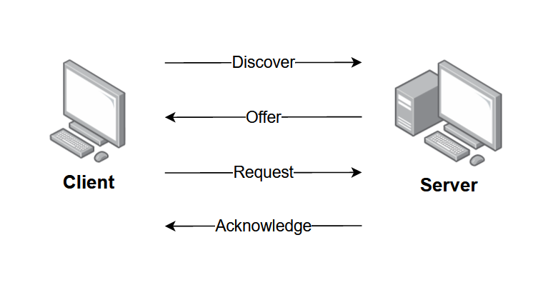

# DHCP (Dynamic Host Configuration Protocol)

## What is DHCP?

**Definition:**  
**DHCP (Dynamic Host Configuration Protocol)** is an **Application Layer protocol** that **automatically assigns IP addresses and other network configuration parameters** to devices (clients) on a network, eliminating the need for manual configuration.

Without DHCP, every device joining a network would need its IP address, subnet mask, default gateway, and DNS server addresses configured manually — an impractical approach at scale.

**Port:** UDP **67** (Server) / UDP **68** (Client)  
**Layer:** Application Layer (Layer 7)  
**Transport:** UDP  
**RFC:** 2131  
**Predecessor:** BOOTP (Bootstrap Protocol) — DHCP is an extension of BOOTP.

---

## 1. What DHCP Assigns

A DHCP server can provide a client with all the parameters needed for full network connectivity:

| Parameter | Description | Example |
|-----------|-------------|---------|
| **IP Address** | Unique logical address for the client | `192.168.1.105` |
| **Subnet Mask** | Defines the network boundary | `255.255.255.0` |
| **Default Gateway** | IP of the router to reach other networks | `192.168.1.1` |
| **DNS Server(s)** | IP addresses of DNS resolvers | `8.8.8.8`, `8.8.4.4` |
| **Lease Time** | Duration the assigned IP is valid | 86400 seconds (24 hours) |
| **Domain Name** | Network domain name | `corp.example.com` |
| **NTP Server** | Time synchronisation server | `time.google.com` |

---

## 2. DHCP DORA Process

The IP lease process between a DHCP client and server follows four steps, collectively called **DORA**:

**D**iscover → **O**ffer → **R**equest → **A**cknowledge




### Step-by-Step Description

| Step | Message | Sender | Destination | Purpose |
|------|---------|--------|-------------|---------|
| **1. Discover** | DHCPDISCOVER | Client | Broadcast (255.255.255.255) | Client has no IP; broadcasts to find any DHCP server |
| **2. Offer** | DHCPOFFER | Server | Broadcast (or unicast) | Server proposes an available IP and configuration |
| **3. Request** | DHCPREQUEST | Client | Broadcast | Client formally requests the offered IP (also informs other servers their offer was declined) |
| **4. Acknowledge** | DHCPACK | Server | Broadcast (or unicast) | Server confirms the assignment; lease begins |

**Note:** All early messages use **broadcast** because the client does not yet have an IP address and cannot be targeted directly. The client's MAC address is used for identification.

---

## 3. DHCP Lease and Renewal

An IP address is not permanently assigned — it is **leased** for a specific duration.

### Lease Lifecycle

```
[Lease Starts]
      │
      │  At 50% of lease time → T1 (Renewal Time)
      ▼
[Client sends DHCPREQUEST directly to its server]
      │  If server ACKs → lease renewed
      │  If server does not respond...
      │
      │  At 87.5% of lease time → T2 (Rebinding Time)
      ▼
[Client broadcasts DHCPREQUEST to ANY server]
      │  If any server ACKs → new lease from that server
      │  If no response...
      ▼
[Lease expires → client loses IP and must restart DORA]
```

| Timer | Default | Action |
|-------|---------|--------|
| **T1 (Renewal)** | 50% of lease time | Client unicasts renewal request to its server |
| **T2 (Rebinding)** | 87.5% of lease time | Client broadcasts to any server |
| **Lease Expiry** | 100% | IP released; client must get a new one |

### DHCPRELEASE

When a device intentionally disconnects (graceful shutdown), it sends a **DHCPRELEASE** to return the IP to the server's available pool immediately.

---

## 4. DHCP Message Types

| Message | Direction | Purpose |
|---------|-----------|---------|
| **DHCPDISCOVER** | Client → Broadcast | Find available DHCP servers |
| **DHCPOFFER** | Server → Client | Offer an IP address and configuration |
| **DHCPREQUEST** | Client → Broadcast | Request the offered IP / renew a lease |
| **DHCPACK** | Server → Client | Acknowledge and confirm the assignment |
| **DHCPNAK** | Server → Client | Negative acknowledgment; IP is not available or lease invalid |
| **DHCPDECLINE** | Client → Server | Client found the offered IP is already in use (ARP probe detected conflict) |
| **DHCPRELEASE** | Client → Server | Client releases its IP back to the pool |
| **DHCPINFORM** | Client → Server | Client already has an IP; requests only other configuration parameters |

---

## 5. DHCP Relay Agent

**Problem:** Broadcasts don’t cross routers

**Solution:**

* Relay agent forwards requests to remote DHCP server
* Uses **giaddr** to identify client subnet

---

## 6. DHCP Server Configuration Concepts

| Concept | Description |
|---------|-------------|
| **IP Pool / Scope** | Range of IP addresses the server can assign (e.g., 192.168.1.100–192.168.1.200) |
| **Exclusions** | IP addresses within the pool that are reserved for manual assignment |
| **Reservations (Static DHCP)** | A specific IP always assigned to a specific MAC address (predictable addressing without fully manual config) |
| **Lease Duration** | How long each assignment lasts before renewal is needed |
| **Conflict Detection** | Server pings or ARPs an address before assigning it, to avoid assigning an already-in-use IP |

---

## 7. DHCP Security Concerns

| Attack | Description | Mitigation |
|--------|-------------|-----------|
| **DHCP Starvation** | Attacker floods server with fake DISCOVER messages (spoofed MACs) to exhaust the IP pool | DHCP snooping, port-based MAC limiting |
| **Rogue DHCP Server** | Attacker sets up an unauthorised DHCP server that assigns itself as the default gateway (MITM) | DHCP snooping — marks trusted/untrusted switch ports |
| **DHCP Snooping** | Security feature on managed switches; only allows DHCP replies from trusted ports | Enable on enterprise switches |

---

## 8. Static vs Dynamic IP Assignment

| Method | Description | Pros | Cons |
|--------|-------------|------|------|
| **Static (Manual)** | Admin manually sets each device's IP | Predictable, stable | Time-consuming; error-prone at scale |
| **Dynamic DHCP** | Server automatically assigns from pool | Zero-config for clients; efficient address use | IP can change on reconnection |
| **DHCP Reservation** | DHCP always gives specific IP to specific MAC | Automated but predictable | Requires MAC-to-IP mapping config |

---

## Summary

* DHCP automates IP configuration

* Uses **DORA process** when a client joins the network

* Works with **leased IP addresses**

* Supports scalability and easy network management

---
