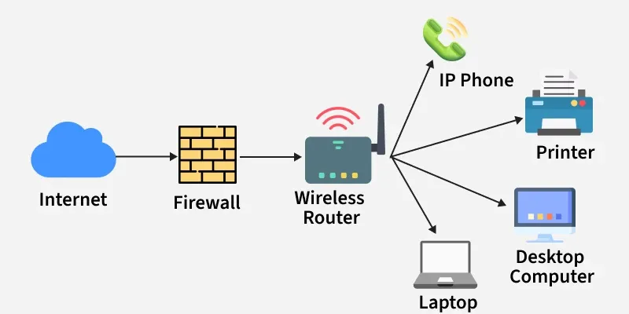

# Computer Networking

## What is Computer Networking?

A **Computer Network** is a system that **connects two or more computing devices** (like computers, servers, routers, or mobile devices) so that they can **communicate, share resources, and exchange data** over wired or wireless media.

**Example of a Simpe Computer Network**

- A **Computer Network** is an interconnected collection of autonomous computing devices that communicate with each other  
using a common set of protocols over transmission media to share data and resources.

- These devices can be located in the same physical location (like an office) or spread across different geographical areas (like the Internet).

---

## Basic Components of a Computer Network

| Component | Description | Example |
|------------|--------------|----------|
| **Nodes (Hosts)** | Devices that send or receive data | Computers, smartphones, IoT devices |
| **Links** | The medium that connects nodes | Copper wires, fiber optics, Wi-Fi |
| **Network Interface** | Hardware interface for communication | Network Interface Card (NIC) |
| **Switches / Routers** | Devices that manage data transfer between networks | Cisco router, TP-Link switch |
| **Protocols** | Rules that define how data is transmitted | TCP/IP, HTTP, FTP |
| **Transmission Media** | Physical or wireless path for data | Ethernet cable, Radio waves |

---

## Goals of Computer Networking

The primary purpose of computer networking is to ensure **communication**, **resource sharing**, **data integrity**, and **efficiency** in distributed environments.

Below are the major goals:

### 1. Resource Sharing
- The main goal of networking is to **enable multiple users to share hardware, software, and data resources** efficiently.
- Examples include sharing:
  - Printers, scanners, and storage drives (hardware resources)
  - Applications, databases, and servers (software resources)
  - Data files and internet access (information resources)

### 2. Communication
- Networking provides a platform for **data and message exchange** among users or applications.
- Enables real-time communication such as:
  - Email, voice calls, video conferencing
  - Instant messaging and data streaming
- Communication can be **unicast (one-to-one)**, **multicast (one-to-many)**, or **broadcast (one-to-all)**.

### 3. Scalability
- Networks are designed to **accommodate growth**.
- Additional devices or users can be added to the network without major reconfiguration or system changes.
- Example: Expanding a Local Area Network (LAN) to include new computers or servers.

### 4. Reliability and Fault Tolerance
- A reliable network ensures **uninterrupted connectivity** and **error-free data transmission**.
- Implemented using redundancy techniques like:
  - Backup links and routes
  - Mirrored servers
  - Error detection and correction protocols
- If one component fails, others continue to operate without total system failure.

### 5. Data Sharing and Accessibility
- Networking enables centralized data storage and provides controlled access to authorized users.
- Facilitates collaborative work and consistent data availability.
- Example: Shared file servers, cloud-based document storage systems.

### 6. Performance and Efficiency
- Ensures **fast, efficient, and optimized data transmission** through:
  - Routing algorithms
  - Bandwidth management
  - Traffic control mechanisms
- Performance metrics include **throughput**, **latency**, and **bandwidth utilization**.

### 7. Security
- Protects data from unauthorized access, loss, or alteration.
- Achieved through:
  - **Encryption:** Data confidentiality during transmission
  - **Authentication:** User identity verification
  - **Firewalls and Intrusion Detection Systems:** Network protection
- Security ensures **confidentiality, integrity, and availability (CIA Triad)**.

### 8. Cost Efficiency
- Reduces hardware and operational costs by sharing resources.
- Centralized management reduces maintenance overhead.
- Example: A single server hosting applications for multiple users rather than individual installations.

---

## Classification by Scale

| Network Type | Full Form | Coverage Area | Example |
|---------------|------------|----------------|----------|
| **PAN** | Personal Area Network | Few meters | Bluetooth, USB connection |
| **LAN** | Local Area Network | Within a building | Home/Office Wi-Fi |
| **MAN** | Metropolitan Area Network | City-level network | Cable TV network |
| **WAN** | Wide Area Network | Across countries | Internet |

---

## Examples of Real-World Networking

1. **Home Network:**  
   - Connects personal devices (laptop, smartphone, smart TV) using Wi-Fi.
2. **Office Network:**  
   - Connects computers, printers, and servers within a company LAN.
3. **Internet Service Provider (ISP):**  
   - Provides WAN connectivity to homes and businesses.
4. **Cloud Networks:**  
   - Enable remote data access, storage, and processing via services like AWS, Google Cloud, and Azure.

## Summary

| Feature | Description |
|----------|-------------|
| **Definition** | Interconnection of computers/devices to share resources and communicate. |
| **Core Function** | Data communication and resource sharing. |
| **Main Components** | Nodes, Links, Protocols, Media, Network Devices. |
| **Primary Goals** | Communication, Resource Sharing, Reliability, Security, Scalability. |
| **Real-Life Example** | Internet, Wi-Fi networks, Cloud systems, Office LANs. |

---
