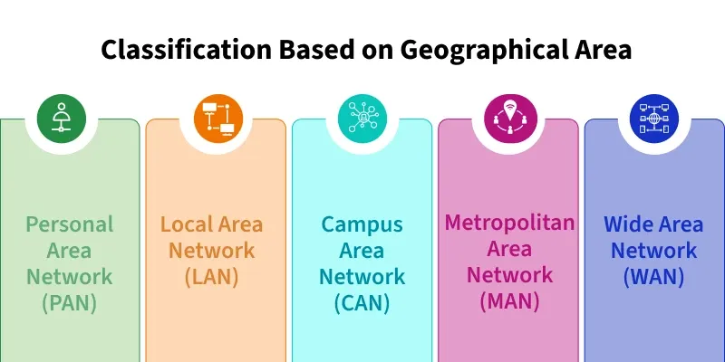

# Types of Computer Networks

A **Computer Network** is a collection of interconnected devices that communicate and share resources.  

Based on their **geographical coverage**, **ownership**, and **scale**, networks are classified into several types.  

The four fundamental categories are **Personal Area Network (PAN)**, **Local Area Network (LAN)**, **Metropolitan Area Network (MAN)**, and **Wide Area Network (WAN)**.

---

## 1. Personal Area Network (PAN)

### Overview

A **Personal Area Network (PAN)** is the smallest and most basic type of network.  
It is designed for **personal device interconnections** within an individual’s workspace — typically within a range of a few meters.

### Working

- PAN connects devices like smartphones, laptops, tablets, and printers.  
- It can be **wired** (using USB or cables) or **wireless** (using Bluetooth or Wi-Fi Direct).  
- Often used for **data synchronization**, **file transfer**, and **internet sharing** between personal devices.

### Key Characteristics

- **Range:** 1–10 meters  
- **Ownership:** Personal / Individual  
- **Speed:** Generally up to 10 Mbps (Bluetooth)  
- **Connectivity:** Temporary and ad-hoc in nature

### Advantages

- Easy setup and maintenance.  
- Low cost; no need for centralized infrastructure.  
- Ideal for short-range communication between personal gadgets.

### Disadvantages

- Very limited range and coverage.  
- Low data transfer speed compared to larger networks.  
- Not suitable for multi-user or enterprise environments.

### Examples

- Bluetooth connection between phone and headphones.  
- Laptop connected to smartphone hotspot.  
- Wireless keyboard or mouse.

---

## 2. Local Area Network (LAN)

### Overview

A **Local Area Network (LAN)** connects computers and devices within a **limited geographical area** such as an office, building, or school.  
It is the most common network type for internal organizational communication.

### Working

- Multiple devices (computers, printers, servers) are connected through **switches**, **routers**, and **Ethernet cables** or **Wi-Fi**.  
- Enables **file sharing**, **printer access**, and **application sharing** among connected systems.  
- Uses high-speed connections (100 Mbps to 10 Gbps).

### Key Characteristics

- **Range:** Up to a few kilometers (building or campus).  
- **Ownership:** Private, managed by one organization.  
- **Transmission Medium:** Ethernet (wired) or Wi-Fi (wireless).  
- **Topology:** Commonly uses **Star**, **Bus**, or **Ring** topology.

### Advantages

- High data transfer speed.  
- Centralized data management and resource sharing.  
- Secure, reliable, and easy to maintain within a closed environment.

### Disadvantages

- Limited to local areas.  
- Setup and maintenance can be costly for large-scale networks.  
- Requires skilled network administrators.

### Examples

- Office network connecting workstations, printers, and file servers.  
- Wi-Fi network in a home or school.  
- Computer lab network in universities.

---

## 3. Metropolitan Area Network (MAN)

### Overview

A **Metropolitan Area Network (MAN)** interconnects multiple LANs within a **metropolitan area**, such as a city or large campus.  
It acts as a **bridge** between LAN and WAN in terms of size and scope.

### Working

- MANs connect several LANs using **fiber optic cables**, **microwave links**, or **wireless connections**.  
- Used by organizations with multiple branches in a single city.  
- Managed either by a **single entity** (organization) or a **telecom service provider**.

### Key Characteristics

- **Range:** Up to 50 kilometers (city-level).  
- **Speed:** Typically ranges from 100 Mbps to 1 Gbps.  
- **Ownership:** Can be public or private.  
- **Technology Used:** Fiber Distributed Data Interface (FDDI), Metro Ethernet, ATM.

### Advantages

- High-speed communication between multiple LANs.  
- Efficient for connecting corporate or university branches within a city.  
- Provides reliable and dedicated connectivity.

### Disadvantages

- Setup and operational costs are higher than LANs.  
- Complex installation and maintenance.  
- Vulnerable to external interference if using wireless media.

### Examples

- City-wide broadband network.  
- Interconnected bank branches within a metropolitan area.  
- Cable television distribution networks.

---

## 4. Wide Area Network (WAN)

### Overview

A **Wide Area Network (WAN)** spans a **large geographical area**, connecting multiple LANs and MANs across cities, countries, or continents.  
It is the **largest type of network**, often operated by telecommunications providers.

### Working

- WAN uses **public transmission systems** such as fiber optics, satellites, or leased telephone lines.  
- Facilitates **long-distance communication** and **data exchange** among distributed systems.  
- The **Internet** is the best example of a global WAN.

### Key Characteristics

- **Range:** Global (up to thousands of kilometers).  
- **Ownership:** Public or consortium-based (e.g., ISPs, telecom providers).  
- **Speed:** Typically 1 Mbps to several Gbps depending on infrastructure.  
- **Technologies Used:** MPLS, Frame Relay, VPN, ATM, Satellite links.

### Advantages

- Enables worldwide connectivity.  
- Facilitates communication between remote offices and data centers.  
- Supports cloud computing, distributed systems, and online services.

### Disadvantages

- Expensive setup and maintenance.  
- Slower transmission speeds compared to LAN due to longer distances.  
- Greater exposure to security threats and data breaches.  
- Complex to manage due to scale and dependency on service providers.

### Examples

- The Internet (global WAN).  
- Corporate network connecting offices across continents.  
- International banking networks.

---

## Comparison Table

| Feature | **PAN** | **LAN** | **MAN** | **WAN** |
|----------|----------|----------|----------|----------|
| **Full Form** | Personal Area Network | Local Area Network | Metropolitan Area Network | Wide Area Network |
| **Coverage Area** | Up to 10 meters | Up to a few kilometers | Up to 50 kilometers | Country or worldwide |
| **Ownership** | Individual | Single organization | Single or multiple organizations | Multiple organizations (ISPs) |
| **Speed** | Up to 10 Mbps | 100 Mbps – 10 Gbps | Up to 1 Gbps | 1 Mbps – 1 Gbps |
| **Transmission Medium** | Bluetooth, Wi-Fi | Ethernet, Wi-Fi | Fiber optics, microwave | Fiber optics, satellite |
| **Setup Cost** | Very Low | Moderate | High | Very High |
| **Maintenance** | Simple | Moderate | Complex | Very Complex |
| **Examples** | Bluetooth, USB | Office Wi-Fi, LAN | Cable TV, City ISP | Internet |

---

## Summary

- **PAN** connects personal devices in a short range for individual use.  

- **LAN** interconnects computers and peripherals within buildings or campuses.  

- **MAN** links multiple LANs within a city for organizational connectivity.  

- **WAN** connects MANs and LANs globally, enabling Internet-scale communication.

> The progression **PAN → LAN → MAN → WAN** represents the **increasing range, complexity, and scalability** of computer networks.

---