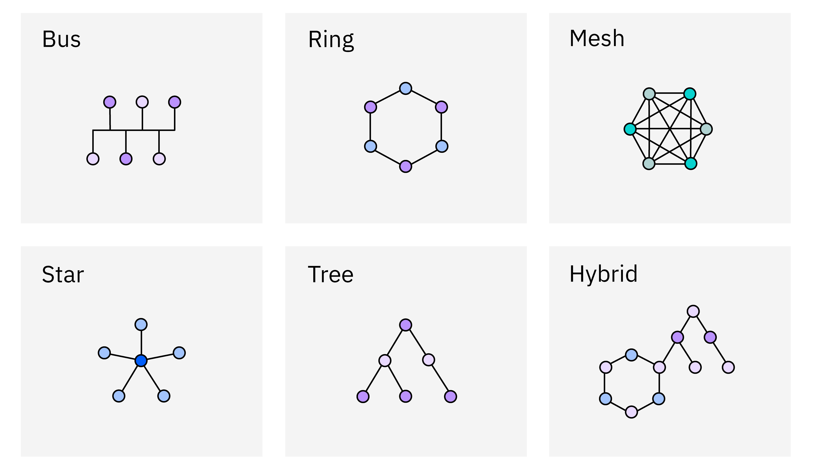

# Network Topologies

A **Network Topology** defines the **physical or logical arrangement** of computers, cables, and other devices within a network.  
It describes **how nodes are interconnected** and how data flows between them.

Network topology plays a crucial role in **network design, performance, fault tolerance, and scalability**.

**There are six fundamental types of network topologies**:

---

## 1. Bus Topology

### Overview

In a **Bus Topology**, all devices are connected to a **single central communication line (the bus or backbone cable)**.  
Each node communicates via this shared medium, and data is transmitted in both directions until it reaches the destination node.

### Working

- A single coaxial or Ethernet cable acts as the main communication path.  
- Each node is connected to this main cable using a **T-connector**.  
- When a node sends a message, it is broadcast to all devices, but only the **intended recipient** accepts and processes it.

### Key Characteristics

- **Communication Medium:** One central cable (bus).  
- **Data Flow:** Bidirectional (depends on implementation).  
- **Termination:** Both ends require terminators to prevent signal reflection.

### Advantages

- Simple to design and install.  
- Requires minimal cabling compared to other topologies.  
- Cost-effective for small networks.

### Disadvantages

- A failure in the backbone cable brings down the entire network.  
- Performance decreases as more devices are added.  
- Difficult to identify faults and troubleshoot.  
- Heavy traffic leads to data collisions.

### Example

- Early Ethernet networks using coaxial cables.

---

## 2. Star Topology

### Overview

In a **Star Topology**, all devices are connected to a **central hub or switch**.  
The hub acts as a **communication controller** that manages data transmission between nodes.

### Working

- Each node has an individual point-to-point connection to the hub/switch.  
- Data from a source node is sent to the hub, which then forwards it to the destination node.

### Key Characteristics

- **Central Device:** Hub, switch, or router.  
- **Failure Domain:** If the central hub fails, the entire network stops.  
- **Cable Requirement:** More cables compared to bus topology.

### Advantages

- Easy to install, configure, and maintain.  
- Failure of one node does not affect others.  
- Easy to detect and isolate faults.  
- Scalable – new nodes can be added easily.

### Disadvantages

- Central device failure disrupts the entire network.  
- Requires more cabling (higher installation cost).  
- Network performance depends heavily on hub/switch capacity.

### Example

- Modern Ethernet LANs, Wi-Fi networks (router as central device).

---

## 3. Ring Topology

### Overview

In a **Ring Topology**, each device is connected to exactly **two other devices**, forming a circular pathway.  
Data travels in one direction (unidirectional) or both directions (bidirectional) through the ring until it reaches its destination.

### Working

- Each node receives data from its predecessor and passes it to the next node.  
- A special data packet called a **token** controls data transmission to prevent collisions (in token ring networks).

### Key Characteristics

- **Data Flow:** Unidirectional or bidirectional (dual ring).  
- **Control Mechanism:** Token passing protocol used to manage transmission.

### Advantages

- Predictable data flow and transmission time.  
- No data collisions due to token-based access.  
- Suitable for high-speed LANs.

### Disadvantages

- A break in the ring can disable the entire network.  
- Troubleshooting is difficult.  
- Adding/removing nodes disrupts network operation.  
- Slower compared to modern switched networks.

### Example

- Token Ring (IEEE 802.5) networks, SONET fiber optic rings.

---

## 4. Mesh Topology

### Overview

In a **Mesh Topology**, every node is directly connected to **every other node** in the network.  
It provides **multiple redundant paths**, ensuring data can still reach its destination even if one link fails.

### Types

- **Full Mesh:** Every node connected to every other node.  
- **Partial Mesh:** Some nodes are fully connected, while others connect to only a few.

### Working

- Each node can communicate directly with any other node.  
- If one link fails, data is automatically rerouted through another available path.

### Key Characteristics

- **Reliability:** Very high, due to redundant connections.  
- **Cabling:** Requires extensive wiring and configuration.  
- **Cost:** High due to number of connections.

**Number of connections (links):**  
`n(n-1)/2`
where *n* = number of nodes.

### Advantages

- High fault tolerance and reliability.  
- Efficient data transmission (direct routing).  
- Failure of one link does not affect the entire network.  
- Excellent for critical applications.

### Disadvantages

- Expensive to implement (requires many cables and ports).  
- Complex installation and configuration.  
- Difficult to scale in large networks.

### Example

- Military communication systems.  
- WAN backbone networks.  
- Wireless Mesh Networks (WMNs).

---

## 5. Tree Topology

### Overview
A **Tree Topology** is a hierarchical structure that combines characteristics of **Star** and **Bus** topologies.  
It consists of multiple star-configured networks connected to a central bus.    

### Working

- Nodes are organized in levels, with a root node at the top.  
- Each level is connected to the level above it, forming a branching structure.  
- Data flows from the root to leaf nodes and vice versa.         
### Key Characteristics

- **Hierarchical Structure:** Parent-child relationships between nodes.
- **Scalability:** Easy to expand by adding new branches.  
- **Centralized Management:** Root node controls the network.       

### Advantages

- Scalable and easy to manage.
- Fault isolation is easier due to hierarchical structure.
- Supports large networks with multiple levels.

### Disadvantages

- If the root node fails, the entire network can be affected.
- More cabling required compared to bus topology.
- Complex to configure and maintain.

### Examples

- Organizational networks with multiple departments.
- File systems in computer architecture (directory structure).

---

## 6. Hybrid Topology

### Overview

A **Hybrid Topology** combines **two or more different topologies** (e.g., Star-Bus, Star-Ring) to meet specific organizational needs.  
It inherits the strengths (and sometimes weaknesses) of the topologies it integrates.

### Working

- For example, a company may use **Star topology** within departments (LANs) and connect these LANs using a **Bus topology**.  
- Communication is managed by switches, routers, or gateways that connect different segments.

### Key Characteristics

- **Flexible and Scalable:** Can integrate different network types.  
- **Complex Design:** Depends on organization’s needs and existing infrastructure.

### Advantages

- Scalable and easily extendable.  
- Reliable due to combination of redundant paths.  
- Customizable to meet varied performance requirements.

### Disadvantages

- Complex architecture and management.  
- Expensive to install and maintain.  
- Requires advanced network devices and management tools.

### Examples

- Large corporate networks combining LANs and WANs.  
- University networks (Star-Ring combination).

---

## Comparison Table

| Feature | **Bus** | **Star** | **Ring** | **Mesh** | **Hybrid** |
|----------|----------|----------|----------|----------|------------|
| **Topology Structure** | Single central cable | Central hub/switch | Circular loop | Fully or partially connected | Combination of topologies |
| **Reliability** | Low | Medium | Medium | Very High | High |
| **Failure Impact** | Entire network if main cable fails | Only if hub fails | Entire ring if link fails | Minimal (redundant paths) | Depends on combined topology |
| **Scalability** | Limited | High | Moderate | Difficult | High |
| **Cost** | Low | Moderate | Moderate | Very High | High |
| **Installation** | Easy | Easy | Difficult | Complex | Complex |
| **Data Flow** | Shared bus | Through central hub | Sequential | Point-to-point | Varies |
| **Examples** | Early Ethernet | Office LANs | Token Ring | WAN backbone | Large corporate networks |

---

## Summary

- **Bus Topology:** Simple and cost-effective but not scalable.  

- **Star Topology:** Most common; easy to manage but depends on a central hub.  

- **Ring Topology:** Predictable performance but vulnerable to single-point failures.  

- **Mesh Topology:** Extremely reliable but expensive and complex.  

- **Tree Topology:** Hierarchical and scalable, suitable for large networks.

- **Hybrid Topology:** Combines multiple topologies for flexibility and scalability.

---
