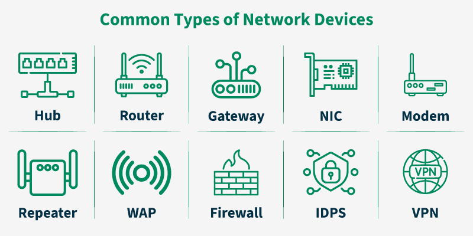

# Computer Network Devices

Network devices (or networking hardware) are the **building blocks** of any computer network.  
They enable communication, manage data flow, and ensure secure and efficient transmission across the network.

Below are the core network devices, described in a clean, structured, placement-ready format.

---

## 1. Network Interface Card (NIC)

**Definition:**  
A **Network Interface Card (NIC)** is a hardware component that allows a computer or device to connect to a network.

**Layer:** Data Link Layer (Layer 2)

**Key Functions:**
* Converts parallel data (computer) to serial data (network).
* Provides a **unique MAC address** to each device.
* Handles framing and error detection.

**Types:**
* Wired NIC (Ethernet)
* Wireless NIC (Wi-Fi)

**Example:**  
Ethernet card, USB Wi-Fi dongle

---

## 2. Hub

**Definition:**  
A **Hub** is a basic networking device that connects multiple computers and forwards data to **all connected devices**.

**Layer:** Physical Layer (Layer 1)

**How It Works:**  
It broadcasts incoming data frames to every port without filtering.

**Types:**
* Active Hub (amplifies signal)
* Passive Hub (no amplification)

**Advantages:**
* Simple and inexpensive  
* Easy installation

**Disadvantages:**
* Broadcasts to all → causes collisions  
* No security or traffic filtering  
* Shared bandwidth

**Example:**  
Early Ethernet networks

---

## 3. Switch

**Definition:**  
A **Switch** is a networking device that forwards frames only to the **specific device** based on MAC address.

**Layer:** Data Link Layer (Layer 2)

**How It Works:**
* Maintains a **MAC address table**.
* Sends frames directly to the correct port instead of broadcasting.

**Advantages:**
* Reduces collisions  
* Supports full-duplex communication  
* More secure than hubs  
* Can support VLANs

**Disadvantages:**
* Costlier than hubs  
* Requires configuration in large networks

**Example:**  
Ethernet switch in LANs

---

## 4. Bridge

**Definition:**  
A **Bridge** connects two or more LAN segments and filters traffic using MAC addresses.

**Layer:** Data Link Layer (Layer 2)

**Functions:**
* Reduces collision domains  
* Learns MAC addresses dynamically  
* Filters unnecessary traffic

**Advantages:**
* Improves performance by segmenting networks  
* Reduces traffic load

**Disadvantages:**
* Cannot route packets  
* Limited to small/medium networks

**Example:**  
Connecting Wi-Fi and wired segments

---

## 5. Router

**Definition:**  
A **Router** is a network device that forwards data packets between different networks based on **IP addresses**.

**Layer:** Network Layer (Layer 3)

**How It Works:**
* Uses routing tables and routing protocols (RIP, OSPF, BGP)
* Selects optimal paths for packet delivery

**Functions:**
* Routing, forwarding  
* Network address translation (NAT)  
* Firewall and security features

**Advantages:**
* Enables Internet connectivity  
* Handles inter-network communication  
* Efficient traffic management

**Disadvantages:**
* More expensive and complex  
* Slight processing delay due to routing decisions

**Example:**  
Home Wi-Fi router, enterprise routers

---

## 6. Gateway

**Definition:**  
A **Gateway** connects networks that use **different protocols**, architectures, or formats.  
It acts as a **protocol converter**.

**Layer:** Multiple layers (typically Layer 5–7)

**Functions:**
* Converts data formats  
* Translates addressing schemes  
* Acts as an entry/exit point to external networks

**Advantages:**
* Ensures interoperability between different systems  

**Disadvantages:**
* High complexity  
* Possible bottleneck if overloaded

**Example:**  
Connecting a corporate LAN to the Internet

---

## 7. Modem

**Definition:**  
A **Modem (Modulator–Demodulator)** converts digital signals from computers into analog signals and vice versa.

**Layer:** Physical / Data Link

**How It Works:**
* **Modulation:** Digital → analog  
* **Demodulation:** Analog → digital

**Advantages:**
* Enables Internet over telephone/cable lines

**Disadvantages:**
* Slower than modern fiber systems  
* Affected by line noise

**Example:**  
DSL modems, cable modems, 4G/5G modems

---

## 8. Repeater

**Definition:**  
A **Repeater** boosts or regenerates weak signals to extend transmission distance.

**Layer:** Physical Layer

**Functions:**
* Reduces attenuation  
* Extends network range

**Advantages:**
* Enhances signal quality  
* Simple and inexpensive

**Disadvantages:**
* Amplifies noise too  
* Cannot filter traffic

**Example:**  
Wi-Fi extender

---

## 9. Access Point (AP)

**Definition:**  
An **Access Point** provides wireless connectivity (Wi-Fi) by connecting wireless devices to a wired LAN.

**Layer:** Data Link Layer

**Functions:**
* Converts wired signals ↔ wireless signals  
* Manages wireless clients and authentication

**Advantages:**
* Extends wireless coverage  
* Supports many users

**Disadvantages:**
* Susceptible to interference  
* Smaller range compared to wired networks

**Example:**  
Wireless access points in offices or campuses

---

## 10. Firewall

**Definition:**  
A **Firewall** monitors and controls network traffic based on security rules.

**Layers:** Network Layer, Transport Layer, Application Layer (depending on implementation)

**Functions:**
* Packet filtering  
* Blocking malicious traffic  
* Protecting internal networks

**Advantages:**
* Prevents unauthorized access  
* Protects against malware/intrusions

**Disadvantages:**
* Can introduce latency  
* Requires expert configuration

**Example:**  
Cisco ASA, pfSense, Windows Firewall

---

## Summary Table

| Device           | OSI Layer | Main Function                    | Behavior/Feature             | Example                |
|------------------|-----------|----------------------------------|------------------------------|------------------------|
| **NIC**          | L2        | Connects device to network       | Provides MAC address         | Ethernet/Wi-Fi card    |
| **Hub**          | L1        | Connects multiple devices        | Broadcasts to all            | Basic LAN hub          |
| **Switch**       | L2        | Forwards frames intelligently    | Uses MAC table               | Ethernet switch        |
| **Bridge**       | L2        | Segments networks                | Filters traffic              | LAN bridge             |
| **Router**       | L3        | Connects different networks      | Uses IP routing              | Wi-Fi router           |
| **Gateway**      | L5–7      | Protocol conversion              | Entry/exit point             | Internet gateway       |
| **Modem**        | L1/L2     | Digital–analog conversion        | Enables cable/DSL Internet   | DSL/cable modem        |
| **Repeater**     | L1        | Regenerates signal               | Extends range                | Wi-Fi repeater         |
| **Access Point** | L2        | Wireless connectivity            | Central Wi-Fi controller     | Wi-Fi AP               |
| **Firewall**     | L3–L7     | Security & traffic filtering     | Blocks unauthorized access   | Cisco ASA, pfSense     |

---