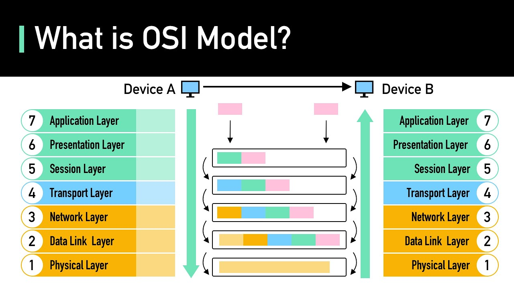

# OSI Model (7 Layers)

---

The **OSI (Open Systems Interconnection) Model** is a conceptual networking framework that standardizes the functions of a communication system into **seven distinct layers**.  
Each layer has specific responsibilities and communicates with the layers directly above and below it.

The OSI model helps in **designing**, **understanding**, and **troubleshooting** network architectures.

---

## 1. Physical Layer (Layer 1)

**Definition:**  
The Physical Layer deals with the **transmission of raw bits** over a physical medium. It defines the **hardware**, electrical signals, and physical data rates.

**Responsibilities:**

* Transmission and reception of raw bitstreams  

* Physical characteristics (voltage, frequencies, pin layout)  

* Data encoding and modulation  

* Defines connectors, cables, and network interface standards  

* Handles bit synchronization  

* Manages attenuation, distortion, and noise

**Devices:**  
Repeater, Hub, Cables (Ethernet, Fiber), NIC (partially)

**Examples:**  
Ethernet cables, Wi-Fi radio signals, DSL signals

---

## 2. Data Link Layer (Layer 2)

**Definition:**  
The Data Link Layer ensures **reliable node-to-node communication** by organizing bits into **frames** and handling error detection.

**Responsibilities:**

* Framing (converting bits → frames)  

* MAC addressing  

* Error detection (CRC) and handling  

* Flow control (stop-and-wait, sliding window)  

* Medium Access Control (CSMA/CD, CSMA/CA)

**Sublayers:**

* **LLC (Logical Link Control)**  

* **MAC (Media Access Control)**

**Devices:**  
Switch, Bridge, NIC

**Examples:**  
Ethernet frames, Wi-Fi (IEEE 802.11)

---

## 3. Network Layer (Layer 3)

**Definition:**  
The Network Layer handles **logical addressing** and **path determination (routing)** for packets across multiple networks.

**Responsibilities:**

* Logical addressing (IP addresses)  

* Routing packets using routing tables  

* Packet fragmentation and reassembly  

* Path determination (shortest/best path)  

* Congestion control

**Devices:**  
Router, Layer-3 Switch

**Protocols:**  
IP (IPv4/IPv6), ICMP, ARP, OSPF, RIP, BGP

**Examples:**  
IP packet routing, traceroute

---

## 4. Transport Layer (Layer 4)

**Definition:**  
The Transport Layer provides **end-to-end communication**, reliability, and flow control between host processes.

**Responsibilities:**

* Reliable/unreliable communication (TCP/UDP)  

* Segmentation and reassembly  

* Error recovery and retransmissions  

* Flow control (sliding window)  

* Connection establishment/termination (TCP handshake)

**Devices:**  
Firewalls, Load Balancers

**Protocols:**  
TCP, UDP

**Examples:**  
Web browsing (TCP), Video streaming (UDP)

---

## 5. Session Layer (Layer 5)

**Definition:**  
The Session Layer manages **sessions** between two communicating devices, ensuring they are properly opened, maintained, and closed.

**Responsibilities:**

* Establishing, maintaining, and terminating communication sessions  

* Session checkpointing and recovery  

* Full-duplex, half-duplex communication management  

* Dialog control

**Examples:**  
Remote Procedure Call (RPC), NetBIOS, SQL sessions

---

## 6. Presentation Layer (Layer 6)

**Definition:**  
The Presentation Layer handles **data translation**, **encryption**, and **compression**, ensuring data is in a usable format for the application.

**Responsibilities:**

* Data format translation (ASCII, Unicode, JPEG, PNG)  

* Encryption and decryption (SSL/TLS at conceptual level)  

* Data compression (zip, MPEG)  

* Serialization (JSON, XML)

**Examples:**  
SSL/TLS encryption, JPEG image formatting

---

## 7. Application Layer (Layer 7)

**Definition:**  
The Application Layer provides **network services directly to end-users and applications**.

**Responsibilities:**

* Network resource access  

* User interface for networking  

* File transfer, email, web browsing  

* Service advertisements and directory services

**Protocols:**  
HTTP, HTTPS, FTP, SMTP, POP3, DNS, SNMP

**Examples:**  
Web browsers, email clients, file transfer apps

---

## Summary Table

| Layer | Name                | Data Unit | Key Responsibilities                            | Devices / Protocols          |
|-------|----------------------|-----------|--------------------------------------------------|------------------------------|
| **7** | Application          | Data      | Network services to user/app                     | HTTP, DNS, FTP               |
| **6** | Presentation         | Data      | Translation, encryption, compression             | SSL/TLS, JPEG, ASCII         |
| **5** | Session              | Data      | Session creation/management                      | RPC, NetBIOS                 |
| **4** | Transport            | Segment   | Reliable delivery, flow control, segmentation    | TCP, UDP                     |
| **3** | Network              | Packet    | Routing, logical addressing                      | IP, ICMP, Routers            |
| **2** | Data Link            | Frame     | Framing, MAC addressing, error detection         | Switch, Bridge, Ethernet     |
| **1** | Physical             | Bits      | Transmission of raw bits, electrical signals     | Cables, Hubs, Repeaters      |

---

## OSI Model Data Encapsulation Process

1. **Application Layer** → User data  

2. **Presentation Layer** → Translation, encryption  

3. **Session Layer** → Establishes session  

4. **Transport Layer** → Segments + port numbers  

5. **Network Layer** → Packets + IP addresses  

6. **Data Link Layer** → Frames + MAC addresses  

7. **Physical Layer** → Transmits bits over medium

---

## Key Points to Remember

* OSI model is conceptual; real-world protocols often map to multiple layers.  

* Layers communicate only with adjacent layers.  

* Encapsulation ensures modularity and interoperability.  

* Helps in troubleshooting by isolating issues layer-wise.  

* Internet protocols (TCP/IP) map roughly to OSI layers, but OSI is more granular.

---
