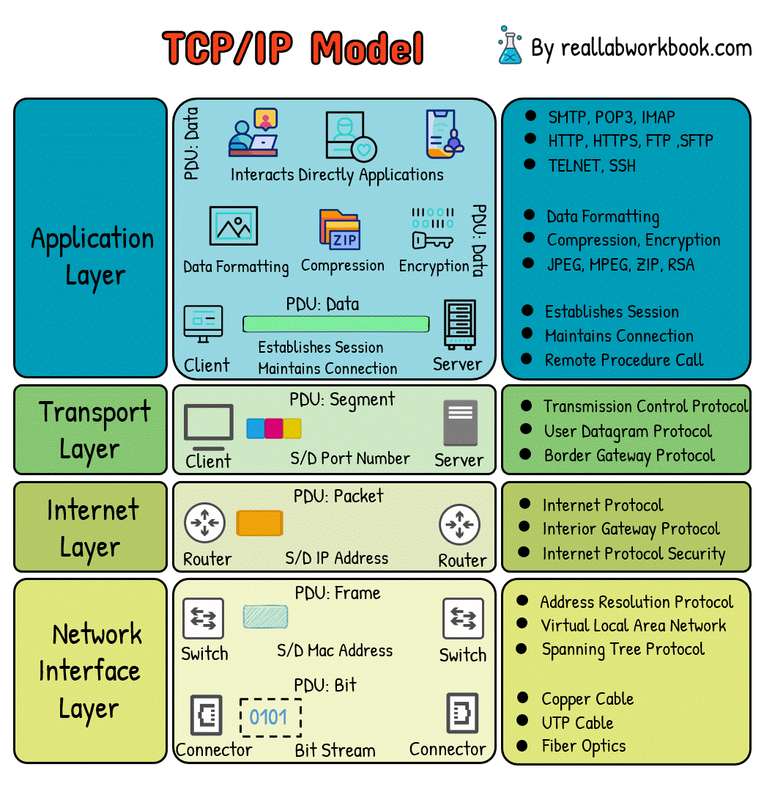

# TCP/IP Model (4/5 Layers)

The **TCP/IP model** (Transmission Control Protocol / Internet Protocol) is the foundational networking framework used in the Internet.  
It defines how data is **packaged**, **addressed**, **transmitted**, **routed**, and **received** across networks.

TCP/IP predates the OSI model, and unlike the 7-layer OSI architecture, TCP/IP uses **4 or 5 layers** depending on the representation.

---

## 1. Five-Layer TCP/IP Model

The modern, detailed representation of TCP/IP has **5 layers**:

1. **Physical Layer**  

2. **Data Link Layer**  

3. **Network Layer**  

4. **Transport Layer**  

5. **Application Layer**

---

## 1. Physical Layer (Layer 1)

**Definition:**  
Responsible for the **physical transmission** of raw bits over a communication medium.

**Responsibilities:**

* Specifies voltage levels, signal types, frequencies  

* Physical connectors, pin layouts  

* Bit-by-bit transmission  

* Handling attenuation, noise, and distortion  

* Defines wired (Ethernet, Fibre) & wireless (Wi-Fi, RF) media

**Examples:**  
Ethernet cables, Wi-Fi signals, Repeaters, Hubs

---

## 2. Data Link Layer (Layer 2)

**Definition:**  
Provides **node-to-node** communication by framing raw bits into **frames** and managing access to the medium.

**Responsibilities:**

* MAC addressing  

* Framing  

* Error detection (CRC)  

* Flow control  

* Medium access (CSMA/CD for Ethernet, CSMA/CA for Wi-Fi)

**Examples:**  
Ethernet (IEEE 802.3), Wi-Fi (IEEE 802.11), Switches, Bridges

---

## 3. Network Layer (Layer 3) — The Internet Layer

**Definition:**  
Handles **logical addressing**, **routing**, and **forwarding** of packets between networks.

**Responsibilities:**

* IP addressing (IPv4/IPv6)  

* Routing packets across networks  

* Packet fragmentation and reassembly  

* Error reporting (ICMP)  

* ARP for MAC-IP resolution

**Protocols:**  
IP, ICMP, ARP, OSPF, RIP, BGP

**Devices:**  
Routers, Layer-3 Switches

---

## 4. Transport Layer (Layer 4)

**Definition:**  
Ensures **end-to-end communication** between devices and provides reliability and flow control when needed.

**Responsibilities:**

* Segmentation and reassembly  

* Connection establishment (TCP 3-way handshake)  

* Reliable delivery (TCP)  

* Unreliable, low-latency delivery (UDP)  

* Flow control and congestion control  

* Port addressing

**Protocols:**  
TCP, UDP

**Examples:**  
Web browsing (TCP), Live streaming (UDP)

---

## 5. Application Layer (Layer 5)

**Definition:**  
Provides **network services directly to applications**.  
It merges the OSI model’s top three layers (**Application, Presentation, Session**) into a single layer.

**Responsibilities:**

* File transfer, email, web communication  

* Data formatting, serialization (JSON, XML)  

* Session management  

* Network resource access

**Protocols:**  
HTTP, HTTPS, FTP, SMTP, DNS, DHCP, SNMP, SSH, Telnet

**Examples:**  
Web browsers, Email clients, DNS servers

---

## 2. Four-Layer TCP/IP Model (Original DoD Model)

The original Department of Defense (DoD) TCP/IP model contains **4 layers**:

1. **Network Access Layer** (Physical + Data Link)  

2. **Internet Layer**  

3. **Transport Layer**  

4. **Application Layer**

---

## Mapping: 4-Layer TCP/IP ↔ 7-Layer OSI

| OSI Layer               | TCP/IP (5-Layer)     | TCP/IP (4-Layer)      |
|-------------------------|-----------------------|------------------------|
| **7. Application**      | Application           | Application            |
| **6. Presentation**     | Application           | Application            |
| **5. Session**          | Application           | Application            |
| **4. Transport**        | Transport             | Transport              |
| **3. Network**          | Network               | Internet               |
| **2. Data Link**        | Data Link             | Network Access         |
| **1. Physical**         | Physical              | Network Access         |

---

## Encapsulation Process in TCP/IP

When sending data:

1. **Application Layer** → Creates user data  

2. **Transport Layer** → Adds TCP/UDP header (segment/datagram)  

3. **Network Layer** → Adds IP header (packet)  

4. **Data Link Layer** → Adds MAC header/trailer (frame)  

5. **Physical Layer** → Transmits bits over medium

On receiving, the reverse process (**decapsulation**) occurs.

---

## Comparison: OSI Model vs TCP/IP Model

| Feature              | OSI (7 Layers)               | TCP/IP (4/5 Layers)            |
|----------------------|------------------------------|---------------------------------|
| **Approach**         | Theoretical, reference model | Practical, implementation model |
| **Layers**           | 7 layers                     | 4 or 5 layers                   |
| **Development**      | ISO                          | DoD (US Department of Defense)  |
| **Mapping**          | Clear separation             | Presentation & Session combined |
| **Uses**             | Academic & design            | Internet communication          |

---

## Summary

* The **TCP/IP model** is the practical framework used globally for Internet communication.  

* It has **5 layers** in modern form or **4 layers** in classical form.  

* Combines the OSI model’s higher layers into a single **Application Layer**.  

* Defines how data is encapsulated, routed, transported, and delivered across networks.

---
