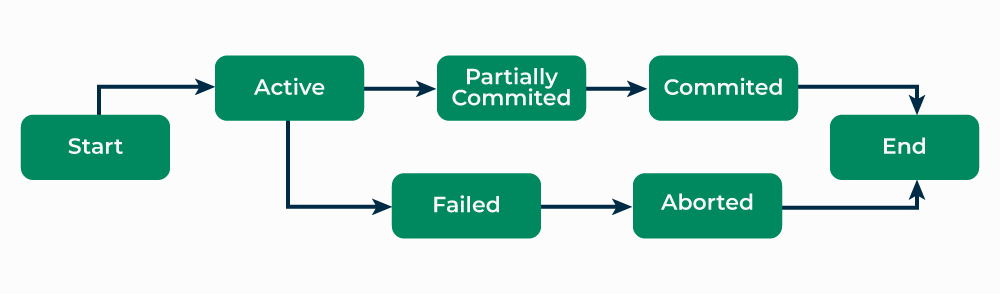

# Transactions in Databases

A **Transaction** is a fundamental concept in database systems that ensures **data correctness**, **consistency**, and **reliability**, especially in the presence of failures or concurrent access.  

Transactions are the unit of work that the DBMS treats as **indivisible and reliable**.

---

## 1. What is a Transaction?

A **Transaction** is a **sequence of one or more database operations** that are executed as a **single logical unit of work**.

Either:
- **All operations succeed**, or  
- **None of them take effect**

This ensures that the database never reaches an **inconsistent state**.

---

## 2. Example of a Transaction

**Bank Transfer Example**

Transfer ₹1000 from Account A to Account B:

```sql
UPDATE account SET balance = balance - 1000 WHERE acc_id = 'A';
UPDATE account SET balance = balance + 1000 WHERE acc_id = 'B';
```

Both operations together form **one transaction**.

* If the first succeeds and the second fails → **inconsistency**
* Therefore, DBMS treats both as a **single atomic transaction**

---

## 3. Transaction States

A transaction passes through multiple states during its lifetime.

### 1. Active

* Transaction is currently executing.

### 2. Partially Committed

* All statements executed, but changes not yet permanent.

### 3. Committed

* All changes successfully saved to the database.
* Transaction completes successfully.

### 4. Failed

* An error occurs; transaction cannot continue.

### 5. Aborted (Rolled Back)

* All changes undone, database restored to previous state.

### 6. Terminated

* Transaction finishes after commit or rollback.

### Transaction State Diagram



---

## 4. Operations in a Transaction

### 1. Read Operation

Reads a data item from the database.

```text
read(A)
```

### 2. Write Operation

Updates a data item in the database.

```text
write(A)
```

---

## 5. Transaction Control Commands (TCL)

DBMS provides commands to manage transactions.

### BEGIN / START TRANSACTION

Marks the beginning of a transaction.

```sql
START TRANSACTION;
```

---

### COMMIT

Makes all changes permanent.

```sql
COMMIT;
```

---

### ROLLBACK

Undo all changes made in the transaction.

```sql
ROLLBACK;
```

---

### SAVEPOINT

Creates a point within a transaction to roll back partially.

```sql
SAVEPOINT sp1;
ROLLBACK TO sp1;
```

---

## 6. Why Transactions are Required

Transactions are required to:

* Maintain **database consistency**
* Prevent **partial updates**
* Handle **system failures**
* Support **concurrent access**
* Ensure **data reliability**

Without transactions, databases would easily become inconsistent during crashes or errors.

---

## 7. Types of Transactions (High-Level)

**1. Read-Only Transaction**

* Only reads data, does not modify it.

**2. Read-Write Transaction**

* Reads and modifies data.

**3. Short Transaction**

* Executes quickly (e.g., OLTP systems).

**4. Long Transaction**

* Takes a long time to complete (e.g., reporting).

---

## Transaction vs Program

| Aspect               | Transaction          | Program               |
| -------------------- | -------------------- | --------------------- |
| **Nature**           | Logical unit of work | Set of instructions   |
| **Failure Handling** | Rollback supported   | No automatic rollback |
| **Atomicity**        | Guaranteed           | Not guaranteed        |
| **Consistency**      | Enforced by DBMS     | Depends on logic      |

---

## Key Takeaways

* A **transaction** is the smallest logical unit of database work.

* Either **all operations succeed or none do**.

* DBMS ensures correctness using commit and rollback.

* Transactions protect data against failures and concurrency issues.

* ACID properties define how transactions behave.

---
