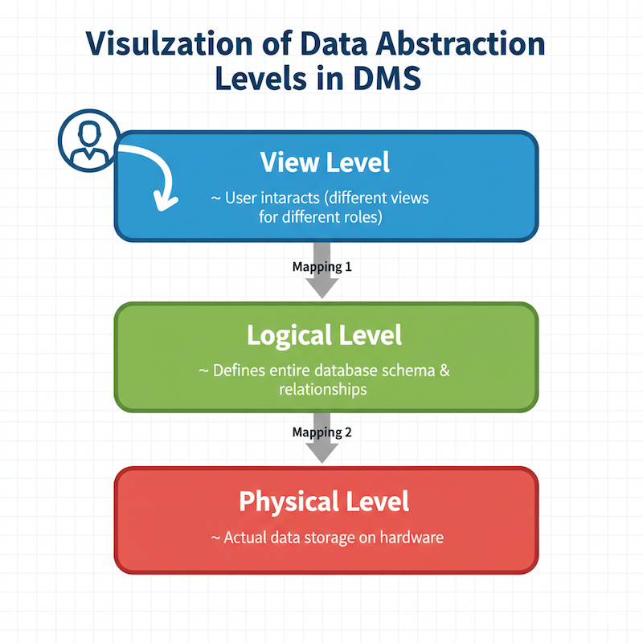
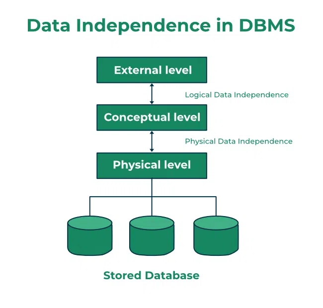

# Data Abstraction

## Definition

Data abstraction in a Database Management System (DBMS) refers to the process of simplifying complex data structures by hiding the intricate details and exposing only the necessary parts to users. 

It allows users to **interact with data without knowing the internal details** of how it is stored or managed.

---

## Why Data Abstraction is Important

- **Simplifies Interaction:** Users need not understand storage structures or indexing.

- **Data Independence:** Changes in one layer do not affect others (logical & physical independence).

- **Security & Privacy:** Hides sensitive implementation details.

- **Consistency:** Multiple views of the same data can be provided to different users.

---

## Levels of Data Abstraction

In a Database Management System (DBMS), data abstraction is typically divided into **three levels**:

### 1. Physical Level (Internal Level)

- **Definition:** Describes **how data is actually stored** in the storage medium (disks, SSDs).

- **Focus:** Low-level details such as:
  - File organization (heap files, B-trees, hash indexing).
  - Record placement, compression, and storage paths.

- **Audience:** Database administrators and system programmers.

- **Example:**  
  - Data is stored as blocks of bytes on disk sectors.
  - Use of indexes for faster retrieval.

### 2. Logical Level (Conceptual Level)

- **Definition:** Describes **what data is stored** in the database and the relationships among those data.

- **Focus:** The **overall structure** of the database, independent of physical storage.
  - Tables, columns, constraints, relationships, and views.

- **Audience:** Database designers and developers.

- **Example:**  
  - A database contains tables for `Employees`, `Departments`, and `Projects` with defined relationships.
  - An `Employees` table has columns like `EmployeeID`, `Name`, `Position`, and `DepartmentID`.

### 3. View Level (External Level)

- **Definition:** Describes **how users interact** with the data.

- **Focus:** Provides **different views of the database** for different users.
  - Each view can show a subset of the database relevant to the user.

- **Audience:** End users, application developers.

- **Example:**  
  - A finance officer sees only `Name`, `RollNo`, `FeePaid` of students.
  - A faculty member sees only `Name`, `RollNo`, `Grades`.

---

## Data Independence

Data abstraction supports **data independence**, meaning changes in one level do not require changes in higher levels.

| Type of Data Independence | Description                                                    | Example                                                                 |
|---------------------------|----------------------------------------------------------------|-------------------------------------------------------------------------|
| **Logical**               | Changes in the logical schema do not affect external views.     | Adding a new column to a table without affecting user applications.     |
| **Physical**              | Changes in physical storage do not affect logical schema.       | Moving data from HDD to SSD or changing file organization internally.   |

---

## Key Differences Between the Levels

| Aspect               | Physical Level                        | Logical Level                          | View Level                              |
|----------------------|----------------------------------------|------------------------------------------|------------------------------------------|
| **Focus**            | Data storage & file organization       | Data model & relationships               | User-specific data access                |
| **Audience**         | DBA, System Engineers                  | Database Designers                        | End Users, Application Developers        |
| **Visibility**       | Internal details of data representation| Complete database structure              | Partial, user-oriented representation    |
| **Data Independence** | Changes rarely affect higher levels    | Independent of physical details          | Independent of both physical & logical   |

---