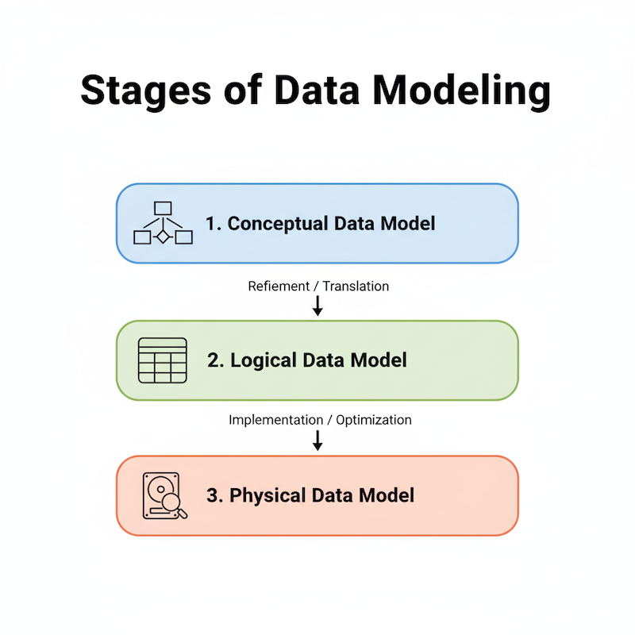

# Key Database Concepts

Below are four fundamental concepts in Database Management Systems (DBMS):  

## Database Schema

### Definition

The **overall logical structure** or **blueprint** of a database describing how data is organized.  
It defines:
- Tables and their attributes (columns, data types)
- Relationships
- Constraints (primary keys, foreign keys, unique, etc.)
- Views and indexes

```
Analogy: Schema is like the blueprint of a building — it describes the design, not the actual contents.
```
### Types of Schemas

- **Physical Schema:** How data is stored on disk.

- **Logical (Conceptual) Schema:** Overall logical 
design (tables, relationships).

- **External Schema:** User-specific views of the database.

### Example

For a university database:
- **Tables**: Students, Courses, Enrollments

- **Relationships**: Students enroll in Courses

- **Constraints**: StudentID is primary key in Students table

- **Views**: View showing all students enrolled in a specific course

---

## Database Instance

### Definition

The **actual data** stored in the database at a specific point in time.
It is a snapshot of the database that can change frequently as data is added, updated, or deleted.

- Changes frequently as data is inserted, updated, or deleted.

- **Schema is static**, but **instances are dynamic**.

```
Analogy: Instance is like the current contents of a building — it changes as people move in or out.
``` 

### Example

For the university database:
- **Instance**:
    - Students Table:
        | StudentID | Name    | Major     |
        |-----------|---------|-----------|
        | 1         | Alice   | CS        |
        | 2         | Bob     | Math      |
    
    - Courses Table:
        | CourseID | Title          | Credits |
        |----------|----------------|---------|
        | 101      | Database Systems| 3       |
    
    - Enrollments Table:                            
        | StudentID | CourseID |
        |-----------|----------|
        | 1         | 101      |
        | 2         | 101      |        

- **This instance can change as new students enroll or existing students drop courses.**

---

## Subschema

### Definition

A **subset of the database schema** that defines **how a particular user or application views the data**.  
It represents a **user’s perspective** of the database.

- Also called the **External Schema** or **User View**.
- Each user/application can have its own subschema tailored to its needs.

```
Analogy: Subschema is like a specific floor plan of a building for a particular tenant — it shows only the areas relevant to them.
``` 

### Features

- Contains only the **tables, attributes, and relationships** relevant to the specific user.

- Hides unnecessary details to provide **security** and **simplicity**.

- Multiple subschemas can exist simultaneously for different users.


### Example

- In a University Database:
  - **Admin Subschema:** Access to Student, Faculty, and Finance tables.
  - **Student Subschema:** Access only to Student Profile and Course Enrollment tables.

---

## Data Modeling

### Definition

The process of creating a **conceptual representation** of the data structures, relationships, and constraints in a database.

- Provides a **high-level view** of the data and its organization.

- Helps in designing the database schema.

### Stages of Data Modeling



1. **Conceptual Data Model**  
   
   - High-level representation of data (business requirements).
   
   - Focus on entities and relationships.  
   
   - **Tool:** Entity-Relationship (ER) Diagram.

2. **Logical Data Model**  
   
   - Converts the conceptual model into a **DBMS-specific logical design**.  
   
   - Defines tables, columns, primary keys, foreign keys, and constraints.

3. **Physical Data Model**  
   
   - Specifies **how data will be stored** in the database.
   
   - Includes indexing, partitioning, storage paths.

### Example

- For a University Database:
  - **Conceptual Model:** Entities like Student, Course, Enrollment with relationships.
  - **Logical Model:** Tables for Students, Courses, Enrollments with keys and constraints.
  - **Physical Model:** Storage details, indexing strategies for performance.

---

## Referential Integrity

### Definition

A **rule that maintains consistency among related tables** by ensuring that a **foreign key value always refers to an existing primary key value** in the parent table.

- Prevents **orphan records** (child records pointing to non-existent parents).
- Ensures that relationships between tables remain valid.

```
Analogy: Referential integrity is like ensuring that every employee in a company has a valid department to belong to.
```

### How It Works
- When inserting a record with a **foreign key**, the DBMS checks if the referenced **primary key** exists in the parent table.
- When deleting or updating a parent record, the DBMS enforces rules to keep the relationship consistent.

### Actions on Parent Deletion/Update

1. **RESTRICT / NO ACTION:** Disallow deletion/update if child rows exist.

2. **CASCADE:** Automatically delete/update child rows.

3. **SET NULL:** Set the foreign key in child rows to NULL.

4. **SET DEFAULT:** Set the foreign key in child rows to a default value.


### Example
- **Two tables**: Departments and Employees

- **Department** (DeptID **PRIMARY KEY**, DeptName)

- **Employee** (EmpID, EmpName, **DeptID FOREIGN KEY**)

- If a Department with DeptID=10 is deleted:
  - **RESTRICT:** Deletion fails if employees belong to DeptID=10.
  - **CASCADE:** All employees in DeptID=10 are deleted.
  - **SET NULL:** Employees’ DeptID becomes NULL.

---

## Summary

- **Database Schema:** The overall structure/blueprint of the database.

- **Database Instance:** The actual data stored in the database at a specific time.

- **Subschema:** A user-specific view of the database schema.

- **Data Modeling:** The process of designing the database structure.

- **Referential Integrity:** Ensures foreign keys correctly reference primary keys to maintain data consistency.

---