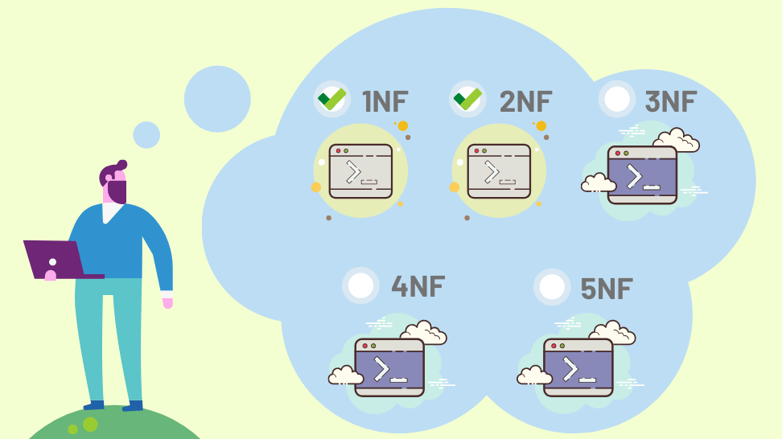

# Introduction to Normalization

**Normalization** is the systematic process of organizing data in a relational database to **reduce redundancy**, **eliminate anomalies**, and **ensure data integrity**.  

It restructures relations into well-formed tables that follow certain **normal forms** (1NF, 2NF, 3NF, BCNF, etc.) based on **functional dependencies**.

Normalization is a core step in **relational database design** and directly improves **storage efficiency, consistency, and query reliability**.

---

## 1. What is Normalization?

### Definition
Normalization is the process of decomposing a relation into **smaller, well-structured relations** while:

- minimizing data redundancy
- eliminating anomalies
- preserving functional dependencies
- ensuring lossless join

It uses **functional dependencies** and **keys** to determine the correct structure of tables.

---

### Example (Intuition)

Unnormalized table:

| StudentID | Name | Course1 | Course2 |
|----------|------|---------|---------|
| 1 | Ravi | DBMS | OS |

Problems:
- repeating groups
- difficulty in adding/removing courses
- redundancy as more courses added

Normalized form separates:

- Student(StudentID, Name)
- Enrollment(StudentID, Course)

---

## 2. Why Normalization is Needed?

Poorly designed databases cause:

- **high redundancy** (same data repeated)
- **update anomalies**
- **inconsistent data**
- **poor scalability**
- **wasted storage**

Normalization restructures such relations into **consistent and efficient schemas**.

---

## 3. Purposes of Normalization

Normalization serves several design goals. The main purposes are:

---

### 3.1 Eliminate Data Redundancy

Redundancy means **storing the same fact multiple times**.

Problems caused:
- wasted space
- inconsistent copies of data
- multiple updates required for single change

Normalization removes unnecessary duplication by splitting data logically.

---

### 3.2 Avoid Anomalies

Normalization removes **anomalies** that occur in unnormalized tables:

| Type of Anomaly | Meaning |
|-----------------|---------|
| **Update Anomaly** | Need to update same value in many places |
| **Insertion Anomaly** | Cannot insert because some unrelated data is missing |
| **Deletion Anomaly** | Deleting one record deletes other valuable data |

Normalization prevents all three.

---

### 3.3 Ensure Data Consistency

By reducing redundancy and anomalies, normalization ensures:

- data is stored in **one correct place**
- changes propagate predictably
- logical rules are preserved

---

### 3.4 Improve Data Integrity

Normalization allows defining:

- primary keys
- foreign keys
- constraints

This enforces **entity integrity** and **referential integrity**.

---

### 3.5 Efficient Query Processing

Normalized tables:

- are smaller
- have indexed key structures
- reduce unnecessary scanning

This improves:

- search performance
- join clarity
- analytical queries

---

### 3.6 Clearer Data Model

Normalization ensures:

- each table represents **one entity**
- relationships are explicitly defined
- schemas are easy to understand and maintain

This simplifies both **design** and **future changes**.

---

## 4. Normal Forms (Overview Only)

Normalization is applied through stages called **normal forms**:

| Normal Form | Main Condition |
|-------------|----------------|
| **1NF** | No repeating groups; atomic attributes |
| **2NF** | No partial dependency on composite key |
| **3NF** | No transitive dependency on non-key |
| **BCNF** | Every determinant is a candidate key |
| **4NF** | Remove multivalued dependencies |
| **5NF** | Remove join dependencies |

(Each of these will be studied in detail separately.)

---

## 5. What Normalization Does NOT Mean

Normalization does **not** mean:

- blindly splitting tables
- fewer joins always worse
- no denormalization ever allowed

Normalization focuses on **correctness first**, performance tuning (denormalization) comes later if necessary.

---

## 6. Key Points About Normalization

- It is based on **functional dependencies**
- It uses **decomposition** techniques
- A good decomposition must be:
  - **lossless**
  - **dependency preserving**
- It is essential for **logical database design**

---

## Summary Table

| Purpose | Explanation |
|--------|-------------|
| Reduce Redundancy | Avoid storing duplicate data |
| Remove Anomalies | Prevent update/insert/delete issues |
| Improve Integrity | Enforce constraints and relationships |
| Maintain Consistency | Ensure single truth of data |
| Better Structure | Logical table design |
| Efficient Queries | Better storage and performance |

---

## Key Takeaways

- Normalization is a **design discipline**, not just a rule set.  
- It organizes data to ensure **minimal redundancy, no anomalies, and strong integrity**.  
- It relies on **functional dependencies** and **keys**.  
- Higher normal forms provide **stronger guarantees** of design quality.  

---
