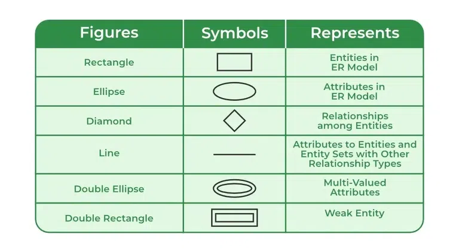

# Introduction to ER Model  

## Definition

- The **Entity–Relationship (ER) Model** is a high-level **data modeling technique** used in database design.  

- It provides a **visual blueprint** of how data is structured and how different pieces of data relate to each other **before** implementation in an RDBMS.

---

## Key Components of an ER Model

| Component       | Description                                                                                          | Example                                      |
|-----------------|------------------------------------------------------------------------------------------------------|----------------------------------------------|
| **Entity**      | A real-world object or concept that can be uniquely identified. Represented by a **rectangle**.       | *Student*, *Course*, *Department*            |
| **Attribute**   | A property/characteristic of an entity. Represented by an **ellipse**.                                | *Student Name*, *Roll No.*, *DOB*            |
| **Relationship**| Association between two or more entities. Represented by a **diamond**.                                | *Enrolled In*, *Teaches*                     |

---

## 1️⃣ Types of Entities
| Type                 | Description                                                             | Example                       |
|----------------------|-------------------------------------------------------------------------|-------------------------------|
| **Strong Entity**    | Exists independently with its own primary key.                          | *Student*, *Course*           |
| **Weak Entity**      | Depends on a strong entity for identification. Needs a **partial key**.  | *Dependent*, *Order Item*     |

---

## 2️⃣ Types of Attributes

- **Simple**: Cannot be divided further. *e.g., Age, ID*  

- **Composite**: Can be subdivided. *e.g., Full Name → First Name + Last Name*  

- **Derived**: Can be calculated. *e.g., Age from DOB*  

- **Multivalued**: Can have multiple values. *e.g., Phone Numbers*  

- **Key Attribute**: Uniquely identifies each entity instance. *e.g., StudentID*

---

## 3️⃣ Relationships in ER Model

A **relationship** represents how two or more entities are connected.

### Cardinality / Degree of Relationships
| Type            | Meaning                                                                                   | Example                                       |
|-----------------|--------------------------------------------------------------------------------------------|-----------------------------------------------|
| **One-to-One (1:1)** | One entity instance of A is related to **only one** instance of B.                        | *Person – Passport*                           |
| **One-to-Many (1:N)**| One entity instance of A is related to **many** instances of B, but B to only one A.      | *Department – Students*                        |
| **Many-to-One (N:1)**| Many instances of A relate to one instance of B.                                         | *Students – University*                        |
| **Many-to-Many (M:N)**| Many instances of A relate to many instances of B.                                      | *Students – Courses*                           |

---

## Degree vs. Cardinality

- **Static Property:** Degree is fixed unless the schema changes.
- Adding a new column increases the degree.
- Removing a column decreases the degree.

| Aspect             | **Degree**                                           | **Cardinality**                              |
|--------------------|-------------------------------------------------------|-----------------------------------------------|
| **Meaning**        | Number of attributes (columns) in a relation          | Number of tuples (rows) in a relation         |
| **Represents**     | **Schema size** (structure)                           | **Data volume** (contents)                    |
| **Changes When**   | Columns are added or removed                          | Rows are inserted or deleted                  |
| **Example**        | 4 columns → Degree = 4                                 | 10 rows → Cardinality = 10                    |

---

## ER Diagram Notations (Chen Notation)

**Read More on how to draw an ER Diagram**: [How to draw an ER Diagram](3.%20How%20to%20draw%20an%20ER%20Diagram.md)

---

