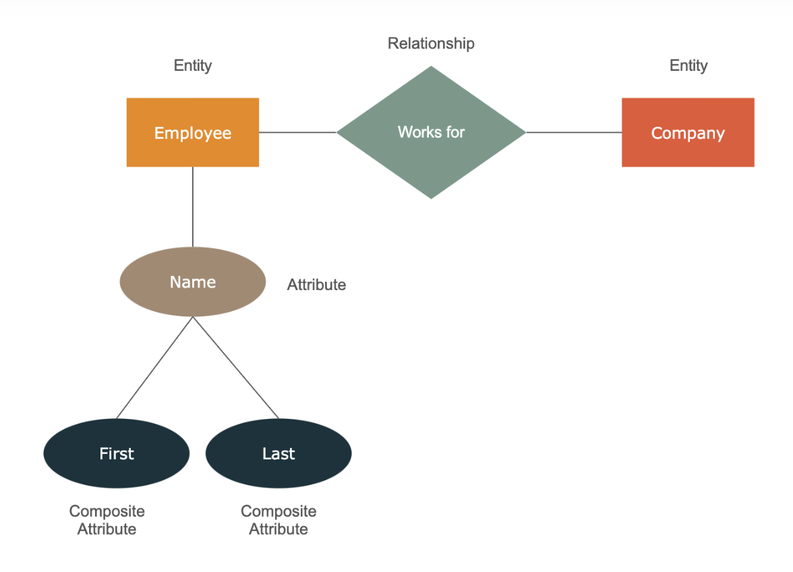
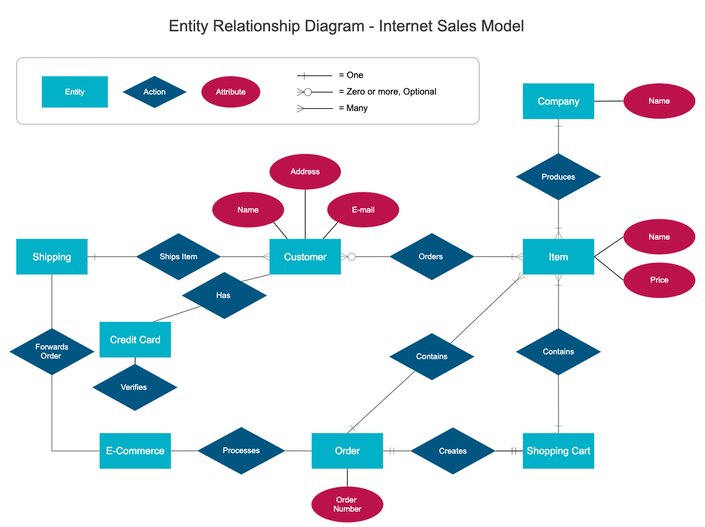

# How to draw an ER Diagram

**ERDs are commonly used in database design to visualize the relationships between entities and their attributes.**

- Represent the logical structure of databases.

- Use symbols (rectangles, diamonds, ovals, lines) to show entities and relationships.

- Used in designing and debugging relational databases.

## Need to Draw ER Diagram

- **Visual Representation**: Provides a clear visual representation of the data structure, making it easier to understand complex relationships.

- **Database Design**: Helps in designing databases by identifying entities, attributes, and relationships.

- **Communication**: Facilitates communication between stakeholders, including developers, database administrators, and business analysts.

- **Documentation**: Serves as documentation for the database structure, useful for future reference and maintenance.

---

## Steps to Draw an ER Diagram

1. **Identify Entities**
   - Look for real-world objects or concepts.
   - Represent entities as **rectangles**.
   - Example: *Student, Course, Teacher, Department*.

2. **Identify Attributes**
   - Determine properties that describe entities.
   - Represent attributes as **ellipses**.
   - Mark **primary key** attributes with an **underline**.
   - Example: *StudentID, Name, Age*.

3. **Identify Relationships**
   - Define how entities are associated with each other.
   - Represent relationships using **diamonds**.
   - Example: *Enrolls, Teaches, Manages*.

4. **Define Cardinality (Mapping)**
   - Specify whether relationships are **1:1, 1:N, N:1, or M:N**.
   - Shown on connecting lines between entities.

5. **Add Weak Entities (if any)**
   - Represent with a **double rectangle**.
   - Connect with an identifying relationship (double diamond).

6. **Add Relationship Attributes (if any)**
   - Some relationships need attributes (e.g., *EnrollmentDate* in Enrolls).

---

## Examples

## Tools to Draw ER Diagrams

- **Online:** Lucidchart, dbdiagram.io, Creately, Draw.io

- **Database Tools:** MySQL Workbench, Oracle Data Modeler

- **Desktop Software:** Microsoft Visio, StarUML

---

