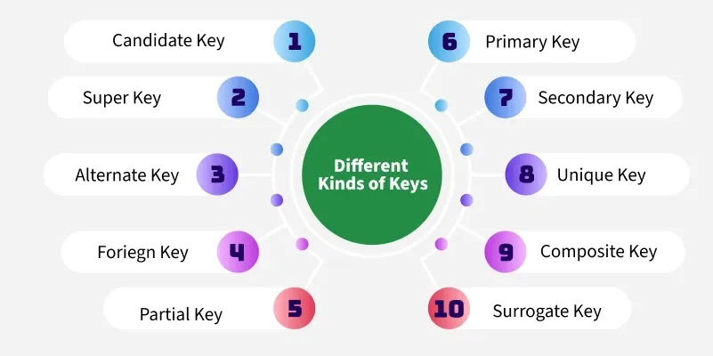

# Keys in Relational Model

In a **Relational Database**, **keys** are attributes (or sets of attributes) that **uniquely identify tuples (rows)** within a relation (table).  

They are essential for maintaining **data integrity** and **establishing relationships** between tables.

---

## 1️⃣ Candidate Key

**Definition:**  
A **candidate key** is a minimal set of attributes that can **uniquely identify a tuple** in a relation.  

- **Uniquely identify** means **no two tuples** can have the same value for the candidate key.

- **Minimal** means **no subset** of the candidate key can uniquely identify a tuple.

**Example:**  
STUDENT(StudentID, Name, RollNo, Email)  

- **Candidate Keys:** StudentID, RollNo, Email  

- Any one of them can serve as a unique identifier.

---

## 2️⃣ Primary Key

**Definition:**  
A **primary key** is the **chosen candidate key** used to uniquely identify tuples.  

- Cannot contain **NULL** values.  

- Only **one primary key per table**.

**Example:**  
- For STUDENT table, choose **StudentID** as primary key.  

| StudentID | Name    | RollNo | Email              |
|-----------|---------|--------|------------------|
| 101       | Alice   | 1001   | alice@mail.com    |

---

## 3️⃣ Super Key

**Definition:**  
A **super key** is a set of one or more attributes that **can uniquely identify a tuple**.  

- May contain **extra attributes** beyond the minimal requirement.

**Example:**  
- {StudentID}, {StudentID, Name}, {RollNo, Email} are all super keys.

> **Note:** Every **candidate key** is a **super key**, but not all super keys are candidate keys.

---

## 4️⃣ Alternate Key

**Definition:**  
An **alternate key** is a **candidate key that is not chosen as the primary key**.  

**Example:**  
- If **StudentID** is the primary key, then **RollNo** and **Email** are alternate keys.

---

## 5️⃣ Foreign Key

**Definition:**  
A **foreign key** is an attribute (or set of attributes) in one table that **refers to the primary key** of another table.  

- Ensures **referential integrity** between related tables.

**Example:**  

**DEPARTMENT Table**  
| DeptID | DeptName  |
|--------|-----------|
| 10     | CSE       |

**STUDENT Table**  
| StudentID | Name  | DeptID |
|-----------|-------|--------|
| 101       | Alice | 10     |

- **DeptID** in STUDENT table is a **foreign key** referencing DEPARTMENT(DeptID).

---

## 6️⃣ Composite Key

**Definition:**  
A **composite key** is a **key made up of two or more attributes** to uniquely identify a tuple.  

**Example:**  
**ENROLLMENT Table**  
| StudentID | CourseID | EnrollmentDate |
|-----------|----------|----------------|
| 101       | CS101    | 2025-01-10     |

- **Composite Primary Key:** {StudentID, CourseID}

---

## 7️⃣ Unique Key

**Definition:**  
A **unique key** enforces **uniqueness** of a column or combination of columns.  

- Similar to primary key but can accept **NULL** values (depending on DBMS).  

**Example:**  
- Email in STUDENT table can be a unique key.

---

## 8️⃣ Partial Key

**Definition:**
A **partial key** is an attribute that can **uniquely identify tuples within a subset** of a relation, often used in weak entities. 

- Cannot uniquely identify tuples in the entire relation.

**Example:**
**DEPENDENT Table** (weak entity)

| DependentName | StudentID | Relationship |
|---------------|-----------|--------------|
| John          | 101       | Son          |

- **Partial Key:** DependentName (uniquely identifies dependents for a given Student
ID, but not across all students)

---

## 9️⃣ Surrogate Key

**Definition:**  
A **surrogate key** is an **artificially created key**, usually a sequential number, used as a primary key. 

- Has no business meaning.

**Example:** Auto-incremented ID in STUDENT table.

| ID | StudentID | Name  |
|----|-----------|-------|
| 1  | 101       | Alice |

**Surrogate Key:** ID

---    

## Key Relationships Overview

| Key Type        | Definition                                                                 | Can be NULL? | Example                        |
|-----------------|---------------------------------------------------------------------------|--------------|--------------------------------|
| **Super Key**   | Any set of attributes uniquely identifying a tuple                         | Yes/No       | {StudentID}, {StudentID, Name}|
| **Candidate Key** | Minimal set of attributes uniquely identifying a tuple                     | No           | {StudentID}, {Email}           |
| **Primary Key** | Chosen candidate key for unique identification                             | No           | StudentID                      |
| **Alternate Key** | Candidate key not chosen as primary key                                   | No           | RollNo, Email                  |
| **Foreign Key** | Attribute referencing primary key in another table                         | Yes/No       | DeptID in STUDENT              |
| **Composite Key** | Key with multiple attributes                                              | No           | {StudentID, CourseID}          |
| **Unique Key**  | Ensures values are unique                                                  | Yes (depends) | Email                           |
| **Partial Key** | Uniquely identifies tuples within a subset (weak entity)                  | No           | DependentName in DEPENDENT      |
| **Surrogate Key** | Artificial key with no business meaning                                  | No           | Auto-incremented ID             |

---