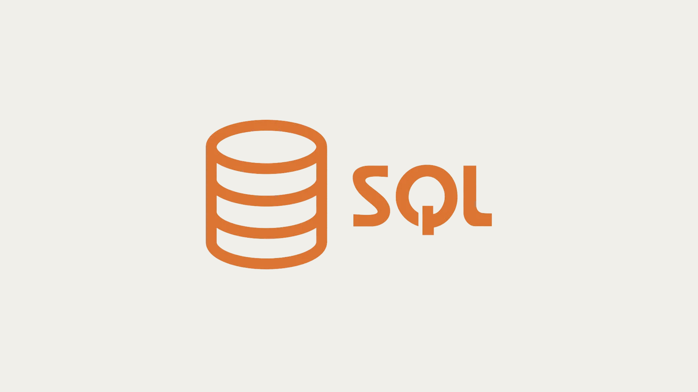
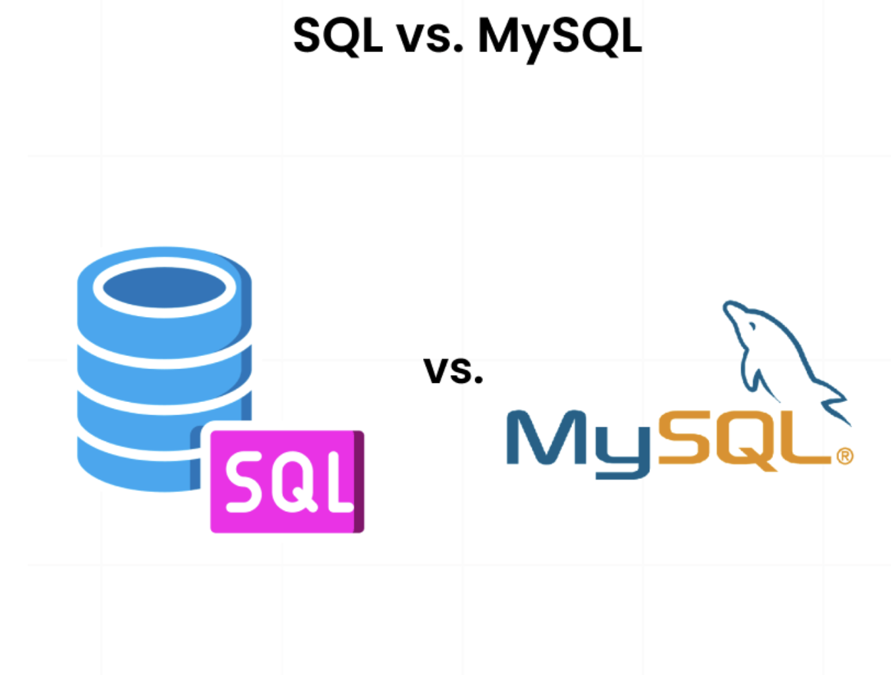

# Introduction to SQL

## Definition

- **SQL (Structured Query Language)** is a **standard language** used to communicate with and manage data in a **Relational Database Management System (RDBMS)**.  

- It allows users to **create**, **read**, **update**, and **delete** data — commonly known as **CRUD** operations.



**SQL is used for**:

- Creating and modifying database structures (tables, schemas)

- Querying and retrieving data

- Inserting, updating, and deleting records

- Managing access permissions and transactions

---

## Why SQL?

SQL is widely used because it provides:

- **Simplicity:** Uses easy-to-understand English-like syntax.

- **Portability:** Works across multiple database systems.

- **Powerful Data Management:** Handles large and complex datasets efficiently.

- **Standardization:** Follows ANSI and ISO standards.

---

## Basic SQL Commands

SQL is divided into different categories based on functionality:

| Category | Command | Purpose |
|-----------|----------|----------|
| **DDL (Data Definition Language)** | `CREATE`, `ALTER`, `DROP`, `TRUNCATE` | Define and modify database structure |
| **DML (Data Manipulation Language)** | `SELECT`, `INSERT`, `UPDATE`, `DELETE` | Manipulate data inside tables |
| **DCL (Data Control Language)** | `GRANT`, `REVOKE` | Control user access and permissions |
| **TCL (Transaction Control Language)** | `COMMIT`, `ROLLBACK`, `SAVEPOINT` | Manage database transactions |
| **DQL (Data Query Language)** | `SELECT` | Retrieve data from the database |

---

## SQL vs MySQL



| Feature | **SQL** | **MySQL** |
|----------|----------|-----------|
| **Definition** | SQL is a **query language** used to manage data in RDBMS. | MySQL is a **Relational Database Management System** that uses SQL as its query language. |
| **Type** | Language | Software/Application |
| **Usage** | Used to **write queries** to interact with databases. | Used to **store and manage** data using SQL queries. |
| **Developer** | Standardized by ANSI/ISO. | Developed by **Oracle Corporation**. |
| **Purpose** | To define and manipulate database data. | To store, retrieve, and organize data using SQL commands. |
| **Examples** | `SELECT * FROM students;` | Executes SQL commands to fetch data from a MySQL database. |
| **Other RDBMS using SQL** | Oracle, PostgreSQL, SQL Server, SQLite | MySQL is one of them. |

---

## How SQL and MySQL Work Together

Let’s break down how SQL commands are executed inside MySQL.

### 1️⃣ User Interaction
- The user or application sends an SQL command (e.g., `SELECT * FROM Students;`).

### 2️⃣ MySQL Parser
- MySQL parses the query to check for **syntax errors** and **valid table/column names**.

### 3️⃣ Optimizer
- The **query optimizer** determines the **best way** to execute the query — using indexes, joins, or scans.

### 4️⃣ Query Execution Engine
- Executes the optimized query plan and interacts with the **storage engine** (like InnoDB or MyISAM ~ [read more about this](https://stackoverflow.com/questions/12614541/whats-the-difference-between-myisam-and-innodb)).

### 5️⃣ Storage Engine
- Retrieves or modifies the data stored in physical files on disk (tables, indexes, etc.).

### 6️⃣ Results Returned
- The result is sent back to the user or application.

---

## Example Workflow

**SQL Query**:

```sql
SELECT Name, Marks FROM Students WHERE Marks > 90;
```

**MySQL Internally Does**:

- **Parse** → Is syntax valid? Are columns present?

- **Optimize** → What’s the fastest way to fetch this data?

- **Execute** → Run the query on the data files.

- **Return** → Display the result set.

---

## Summary 

| Concept       | Description                                                     |
| ------------- | --------------------------------------------------------------- |
| **SQL**       | Language for managing and querying relational data.             |
| **MySQL**     | RDBMS software that implements SQL to manage databases.         |
| **Working**   | SQL query → MySQL Engine → Optimizer → Storage Engine → Result. |
| **Use Cases** | Data analysis, app backend, reporting, data warehousing, etc.   |

---