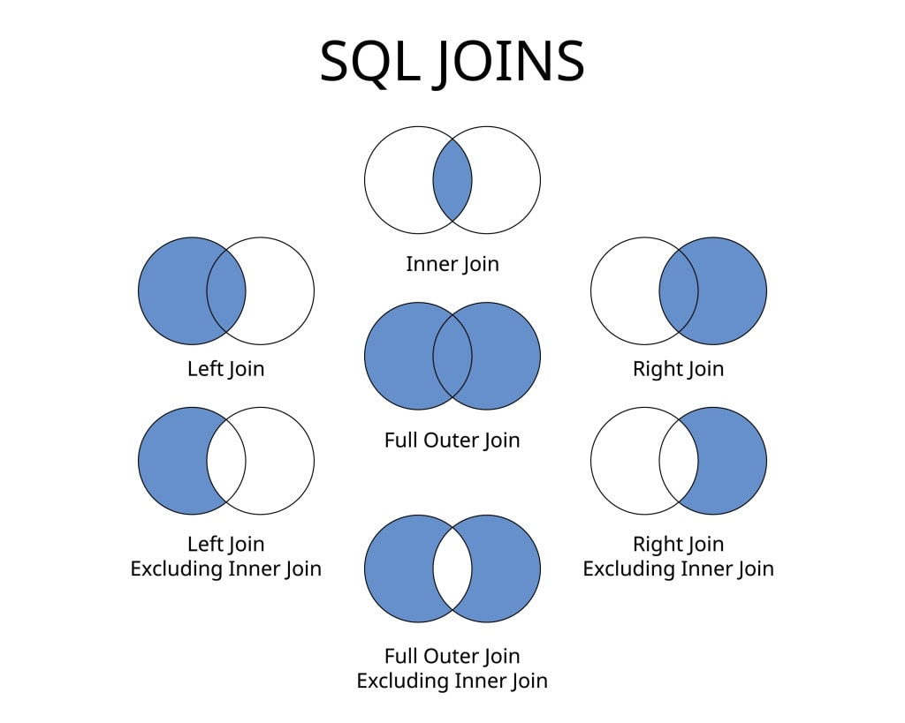
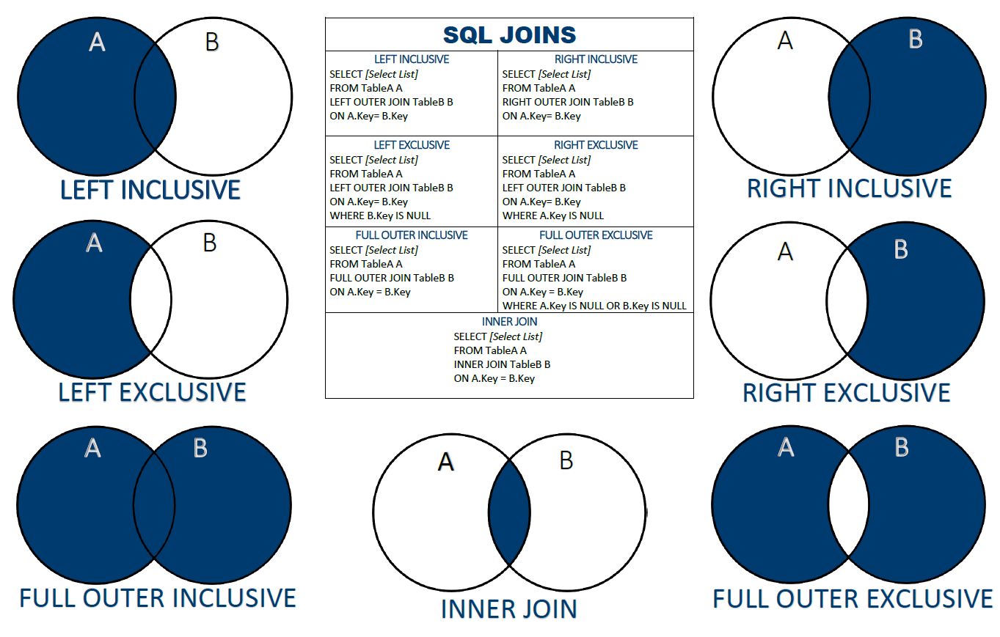

# SQL Joins and Their Types

## What is a Join?
A **JOIN** in SQL is used to **combine data from two or more tables** based on a related column between them — usually a **foreign key**.

It helps you retrieve meaningful information that’s spread across multiple tables in a relational database.

---
## Types of Joins



## Example Setup
Let's consider two tables:

### `Students` Table
| StudentID | Name    | CourseID |
|------------|---------|-----------|
| 1          | Alice   | 101       |
| 2          | Bob     | 102       |
| 3          | Charlie | 103       |

### `Courses` Table
| CourseID | CourseName   |
|-----------|--------------|
| 101       | Math         |
| 102       | Science      |
| 104       | History      |

---

## 1. INNER JOIN
- Returns **only matching rows** from both tables.
- Non-matching rows are **excluded**.

```sql
SELECT Students.Name, Courses.CourseName
FROM Students
INNER JOIN Courses
ON Students.CourseID = Courses.CourseID;
```

**Result:**

| Name  | CourseName |
| ----- | ---------- |
| Alice | Math       |
| Bob   | Science    |

**Only rows where CourseID matches in both tables are shown.**

---

## 2. LEFT JOIN (LEFT OUTER JOIN)

* Returns **all rows from the left table** (Students), and **matching rows from the right table** (Courses).
* If no match, NULLs are returned for right table columns.

```sql
SELECT Students.Name, Courses.CourseName
FROM Students
LEFT JOIN Courses
ON Students.CourseID = Courses.CourseID;
```

**Result:**

| Name    | CourseName |
| ------- | ---------- |
| Alice   | Math       |
| Bob     | Science    |
| Charlie | NULL       |

**All students are shown, even if they don’t have a course.**

---

## 3. RIGHT JOIN (RIGHT OUTER JOIN)

* Returns **all rows from the right table** (Courses) and **matching rows from the left** (Students).
* Non-matching left rows are filled with NULLs.

```sql
SELECT Students.Name, Courses.CourseName
FROM Students
RIGHT JOIN Courses
ON Students.CourseID = Courses.CourseID;
```

**Result:**

| Name  | CourseName |
| ----- | ---------- |
| Alice | Math       |
| Bob   | Science    |
| NULL  | History    |

**All courses are shown, even if no student enrolled.**

---

## 4. FULL OUTER JOIN

* Returns **all rows from both tables**.
* Non-matching rows from either table appear with NULLs.

> Note: Some databases like MySQL don’t directly support `FULL JOIN`; use `UNION` of `LEFT` and `RIGHT JOIN`.

```sql
SELECT Students.Name, Courses.CourseName
FROM Students
FULL OUTER JOIN Courses
ON Students.CourseID = Courses.CourseID;
```

**Result:**

| Name    | CourseName |
| ------- | ---------- |
| Alice   | Math       |
| Bob     | Science    |
| Charlie | NULL       |
| NULL    | History    |

**All data from both sides included.**

---

## 5. CROSS JOIN

* Returns **Cartesian product** — every row from one table is paired with every row from the other.
* Doesn’t require a matching condition.

```sql
SELECT Students.Name, Courses.CourseName
FROM Students
CROSS JOIN Courses;
```

**Result:**

| Name    | CourseName |
| ------- | ---------- |
| Alice   | Math       |
| Alice   | Science    |
| Alice   | History    |
| Bob     | Math       |
| Bob     | Science    |
| Bob     | History    |
| Charlie | Math       |
| Charlie | Science    |
| Charlie | History    |

Useful for generating combinations or testing.

---

## 6. SELF JOIN

* A table is **joined with itself**.
* Useful when comparing rows within the same table (like hierarchical data or relationships).

```sql
SELECT A.Name AS Student1, B.Name AS Student2
FROM Students A, Students B
WHERE A.CourseID = B.CourseID AND A.StudentID <> B.StudentID;
```

**Result:**

| Student1 | Student2 |
| -------- | -------- |
| Alice    | Bob      |
| Bob      | Alice    |

**Shows students enrolled in the same course.**

---

## Summary Table

| Join Type      | Description                 | Returns          |
| -------------- | --------------------------- | ---------------- |
| **INNER JOIN** | Only matching records       | Matches only     |
| **LEFT JOIN**  | All left + matching right   | All left         |
| **RIGHT JOIN** | All right + matching left   | All right        |
| **FULL JOIN**  | All records from both sides | All              |
| **CROSS JOIN** | Cartesian product           | All combinations |
| **SELF JOIN**  | Table joined with itself    | Depends on logic |

---

## Key Takeaways



---
