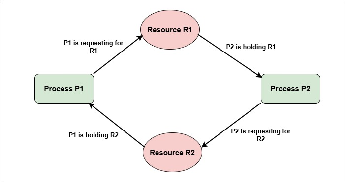

# Deadlock in Operating Systems

**Deadlock** is a critical problem in **process synchronization and resource management** where a set of processes are **permanently blocked**, each waiting for resources held by others.  

Once a deadlock occurs, **no process in the deadlock set can proceed** unless external intervention happens.

---

## 1. What is Deadlock?

### Definition
A **deadlock** occurs when:
> Two or more processes are waiting indefinitely for events (resources) that **can only be caused by the waiting processes themselves**.

In short:
- Everyone is waiting
- No one can move forward

---

## 2. Simple Deadlock Example

Consider two processes and two resources:

- Process P1 holds **R1** and requests **R2**
- Process P2 holds **R2** and requests **R1**

```

P1 → waits for R2 (held by P2)
P2 → waits for R1 (held by P1)

```

Result: **Deadlock**

---

## 3. Necessary Conditions for Deadlock (Coffman Conditions)

A deadlock can occur **if and only if all four conditions hold simultaneously**.

---

### 3.1 Mutual Exclusion
- At least one resource must be **non-shareable**
- Only one process can use the resource at a time

Example:
- Printer, mutex lock

---

### 3.2 Hold and Wait
- A process **holds at least one resource**
- While holding it, the process **waits for additional resources**

---

### 3.3 No Preemption
- Resources **cannot be forcibly taken**
- A resource is released only voluntarily

---

### 3.4 Circular Wait
- A circular chain of processes exists
- Each process waits for a resource held by the next process in the cycle

Example:
```

P1 → R2 → P2 → R1 → P1

```

---

## 4. Resource Allocation Graph (RAG)



A **Resource Allocation Graph** visually represents deadlock situations.

- **Circle** → Process
- **Square** → Resource
- **Edge P → R** → Process requests resource
- **Edge R → P** → Resource allocated to process

### Deadlock Rule
- **Cycle present + single instance per resource → Deadlock**
- **Cycle present + multiple instances → Deadlock possible**

---

## 5. Types of Deadlock

### 5.1 Resource Deadlock
- Processes wait for hardware or software resources

### 5.2 Communication Deadlock
- Processes wait for messages from each other

### 5.3 Livelock (Related Concept)
- Processes keep changing state but make **no progress**

---

## 6. Deadlock vs Starvation

| Aspect | Deadlock | Starvation |
|------|----------|------------|
| Nature | Circular waiting | Indefinite postponement |
| CPU availability | None of deadlocked processes run | Some processes run |
| Cause | Resource dependency | Scheduling unfairness |
| Solution | Deadlock handling | Aging |

---

## 7. Deadlock Handling Strategies

Operating systems handle deadlocks using **four main approaches**.

---

## 7.1 Deadlock Prevention

### Idea
Ensure that **at least one of the four necessary conditions never holds**.

| Condition Broken | Technique |
|------------------|-----------|
| Mutual Exclusion | Make resources sharable (not always possible) |
| Hold and Wait | Request all resources at once |
| No Preemption | Preempt resources |
| Circular Wait | Impose resource ordering |

### Drawback
- Low resource utilization
- Reduced concurrency

---

## 7.2 Deadlock Avoidance

### Idea
Make **careful resource allocation decisions** so that the system never enters an unsafe state.

- Requires advance knowledge of resource needs
- Uses **Banker’s Algorithm**

### Key Concept
- **Safe state** → system can allocate resources without deadlock
- **Unsafe state** → deadlock may occur

---

## 7.3 Deadlock Detection and Recovery

### Detection
- Allow deadlocks to occur
- Periodically check for cycles in resource allocation graph

### Recovery Methods
- Terminate processes
- Preempt resources
- Rollback processes

### Drawback
- Expensive and disruptive

---

## 7.4 Deadlock Ignorance

### Idea
- Assume deadlock is rare
- Ignore it completely

### Used In
- UNIX, Linux (classic approach)

User manually resolves by:
- killing processes
- rebooting system

---

## 8. Deadlock Prevention vs Avoidance

| Aspect | Prevention | Avoidance |
|------|------------|-----------|
| Strategy | Break conditions | Predict future |
| Resource usage | Poor | Better |
| Complexity | Low | High |
| Knowledge needed | No | Yes |

---

## 9. Real-World Analogy

**Traffic deadlock at a four-way intersection**

- Each car holds a position
- Each car waits for another to move
- No car can move → deadlock

Traffic rules (ordering, signals) prevent deadlock.

---

## Summary

| Aspect | Description |
|------|-------------|
| Deadlock | Permanent blocking |
| Cause | Circular resource wait |
| Conditions | 4 necessary conditions |
| Handling | Prevention, Avoidance, Detection, Ignorance |

---

## Key Takeaways

- Deadlock occurs only if **all four conditions** hold  

- Circular wait is the most visible sign  

- Different OSes choose different handling strategies  

- Deadlock is different from starvation  

- Understanding deadlock is essential for system reliability  

---

