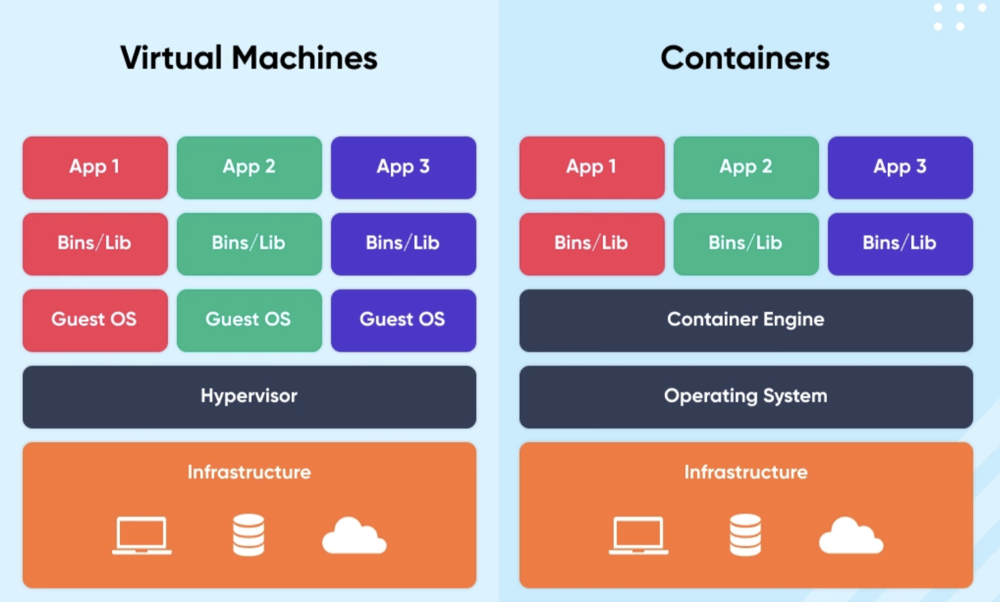

# Virtualization vs Containerization

Modern software deployment relies heavily on **isolation**, **scalability**, and **efficient resource usage**.  

Two major technologies enabling this are **Virtualization** and **Containerization**.  

Both help in running applications in isolated environments but differ significantly in **architecture**, **performance**, and **use cases**.

---

## Definition

### Virtualization

- Virtualization allows multiple **Virtual Machines (VMs)** to run on a single physical machine using a software layer called a **Hypervisor**.

- Each VM runs a **full operating system**, including its own kernel, libraries, binaries, and application code.

- Provides **strong isolation** between environments but with higher resource overhead.

### Containerization

- Containerization packages applications and their dependencies into **lightweight units called containers**.

- Containers **share the host OS kernel**, isolating applications at the **process level** instead of full OS virtualization.

- They are more **lightweight, faster, and efficient** compared to VMs.

---

## Key Differences

| Feature                  | Virtualization (VMs)                                         | Containerization (Containers)                              |
|--------------------------|---------------------------------------------------------------|-------------------------------------------------------------|
| **Architecture**         | Requires a hypervisor + full guest OS for each VM            | Uses shared host OS kernel; no full guest OS                |
| **Isolation Level**      | Strong (hardware / OS-level)                                 | Moderate (process-level)                                    |
| **Startup Time**         | Slow (seconds to minutes)                                    | Very fast (milliseconds)                                     |
| **Resource Usage**       | Heavy; requires large RAM/CPU per VM                         | Lightweight; minimal overhead                                |
| **Performance**          | Lower due to hypervisor overhead                             | Near-native performance                                      |
| **Portability**          | Limited (OS-dependent images)                                | Highly portable across environments                          |
| **Security**             | More secure (full OS isolation)                              | Shared kernel reduces isolation                              |
| **Density**              | Can run fewer VMs per host                                   | Can run many containers per host                            |
| **OS Support**           | Can run multiple OS types (Linux, Windows, etc.)            | All containers must use the same OS kernel                  |
| **Use Case**             | Legacy apps, monolithic systems, OS-level testing            | Microservices, cloud-native apps, DevOps pipelines          |

---

## Virtualization

### How It Works

1. A **Hypervisor** (Type-1 or Type-2) creates multiple VMs.  

2. Each VM contains a **full OS** and virtualized hardware.  

3. Applications run inside each VM independently.

### Advantages

- Strongest isolation  

- Can run different operating systems simultaneously  

- Best for legacy monolithic applications  

- Mature, stable, and widely used in enterprise environments  

### Disadvantages

- Slow startup time  

- Large resource consumption (each VM needs full OS)  

- Requires more disk space and memory  

- Hypervisor overhead reduces performance  

### Examples

- VMware ESXi  
- VirtualBox  
- Microsoft Hyper-V  
- KVM  

---

## Containerization

### How It Works

1. A container engine (Docker, containerd) runs on a host OS.  

2. Each container runs as an **isolated process**, sharing the host OS kernel.  

3. Containers include only necessary libraries, not the full OS.

### Advantages

- Light, fast, and extremely portable  
- Very high density — hundreds of containers per server  
- Ideal for microservices and cloud-native architecture  
- Fast scaling and deployment (DevOps-friendly)  

### Disadvantages

- Weaker isolation since kernel is shared  
- Cannot run different OS kernels  
- Security depends on container runtime hardening  

### Examples

- Docker  
- Podman  
- Kubernetes (for orchestration)  
- LXC  

---

## Summary 

| Aspect                     | Virtual Machines                               | Containers                                      |
|----------------------------|------------------------------------------------|--------------------------------------------------|
| **OS Requirement**         | Full OS per VM                                 | Shared host OS                                   |
| **Boot Time**              | Slow                                           | Instant                                          |
| **Resource Usage**         | High                                           | Low                                              |
| **Security**               | Strong                                         | Moderate                                         |
| **App Isolation**          | Strong                                         | Medium                                           |
| **Portability**            | Limited                                        | Very high                                        |
| **Deployment**             | Slow                                           | Very fast                                        |
| **Best For**               | Legacy apps, OS-level isolation                | Microservices, cloud apps, DevOps workflows      |

---

## Key Takeaways

- **Virtualization** provides strong isolation but is resource-heavy.  

- **Containerization** offers lightweight, portable environments ideal for modern cloud deployments.  

- In industry, both are used together:  
  - VMs provide secure OS-level isolation  
  - Containers run scalable microservices inside VMs  

---
