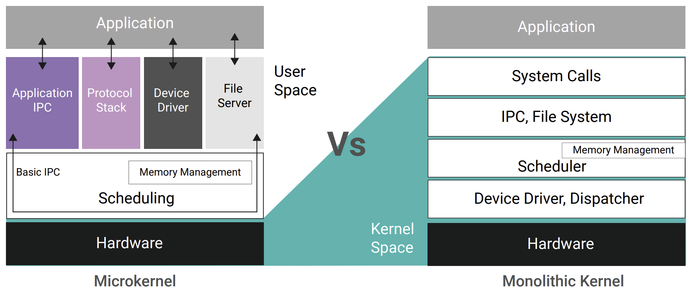

# OS Architectures

Operating System architecture defines **how an OS is structured internally**—how components interact, how services are organized, and how communication occurs between the kernel and user applications.  

Three widely studied architectures are **Monolithic Kernel**, **Microkernel**, and **Hybrid Kernel**.



---

## 1. Monolithic Kernel Architecture

A **Monolithic Kernel** is an OS architecture where **all core OS services run in kernel space** as part of a single large kernel.

This includes:
- Process management  
- Memory management  
- File systems  
- Device drivers  
- Network stack  
- System calls  

All these components execute with **full kernel privileges**.

---

### Characteristics

- Single large executable kernel  

- All OS services run in **kernel mode**  

- Direct communication between kernel components  

- High performance due to direct function calls  

---

### Advantages

- **Fast performance** (no context switching between services)  

- **Efficient system calls**  

- **Better resource sharing** since all components are tightly integrated  

- Less overhead due to absence of inter-process communication (IPC) mechanisms  

### Disadvantages

- **Less secure**: a bug in any kernel module can crash the entire OS  

- Difficult to maintain or debug  

- Hard to extend (adding features requires kernel recompilation)  

- Device drivers running in kernel mode increase risk  

### Examples

- **Linux Kernel**  
- **UNIX variants (BSD, Solaris)**  
- **MS-DOS**  

---

## 2. Microkernel Architecture


A **Microkernel** contains only the **minimal essential components** in kernel space:  
- Inter-process communication (IPC)  
- Basic memory management  
- Basic scheduling  
- Low-level hardware control  

Everything else runs in **user space**, including:
- File systems  
- Device drivers  
- Network protocols  
- OS services  

---

### Characteristics

- Very small kernel (few thousand lines of code)  

- Services run as **separate user-space processes**  

- Communication happens via **message passing (IPC)**  

---

### Advantages

- **Highly secure**: user-space failures do not crash the kernel  

- **Stable**: minimal kernel reduces bugs  

- **Modular and easy to update**  

- Ideal for **embedded systems** and systems requiring high reliability  


### Disadvantages

- **Slower performance** due to frequent IPC and context switching  
- Complex design  
- Overhead of message passing reduces efficiency  

### Examples

- **Minix**  
- **QNX**  
- **GNU Hurd**  
- **L4 Microkernel family**  

---

## 3. Hybrid Kernel Architecture

A **Hybrid Kernel** is a combination of **Monolithic and Microkernel** concepts.  
It attempts to keep performance close to monolithic kernels while retaining modularity like microkernels.

- Core OS services run in **kernel space**  
- Some services or drivers may run in **user space**  
- Uses IPC but also supports direct function calls for performance  

---

### Characteristics

- Medium-sized kernel  

- Supports dynamic modules  

- Better stability than monolithic  

- Better performance than microkernel  

### Advantages

- **Balanced approach** between performance and stability  

- Easier to extend using loadable kernel modules  

- Offers improved fault isolation over pure monolithic kernels  

### Disadvantages

- Can inherit disadvantages of both architectures  

- More complex than monolithic kernels  

- Not as stable as pure microkernels  


### Examples

- **Windows NT (Windows 2000/XP/10/11)**  
- **macOS (XNU kernel)**  
- **iOS kernel**  
- **ReactOS**  

---

## Comparison Table

| Feature                 | Monolithic Kernel                         | Microkernel                                    | Hybrid Kernel                                      |
|-------------------------|--------------------------------------------|------------------------------------------------|-----------------------------------------------------|
| **Kernel Size**         | Large (millions of lines of code)          | Very small (thousands of lines)                | Moderate                                            |
| **Performance**         | Fast (direct calls)                        | Slower (IPC overhead)                           | Near-monolithic performance                         |
| **Stability**           | Lower (bugs crash entire kernel)           | Very high                                       | High                                                |
| **Security**            | Lower                                       | High (user-space isolation)                     | Moderate to high                                    |
| **Ease of Extension**   | Difficult (recompile kernel)               | Easy (modular services)                         | Moderate (loadable modules)                         |
| **Fault Isolation**     | Low                                         | High                                            | Medium                                              |
| **Design Complexity**   | Relatively simple                           | Complex                                        | Complex                                             |
| **Examples**            | Linux, Unix                                | Minix, QNX                                     | Windows NT, macOS                                   |

---

## Graphical Overview (Conceptual)

### Monolithic Kernel
```

+----------------------------+
| User Applications          |
+----------------------------+
| Entire Kernel (drivers, fs,|
| networking, memory, etc.)  |
+----------------------------+
| Hardware                   |
+----------------------------+
```

### Microkernel
```

+------------------------------+
| User Applications            |
+------------------------------+
| OS Services (drivers, fs,    |
| networking) — user space     |
+------------------------------+
| Microkernel (IPC, scheduler, |
| memory mgmt)                 |
+------------------------------+
| Hardware                     |
+------------------------------+
```

### Hybrid Kernel
```

+------------------------------+
| User Applications            |
+------------------------------+
| Some OS services (mixed)     |
+------------------------------+
| Hybrid Kernel                |
+------------------------------+
| Hardware                     |
+------------------------------+
```

---

## Key Takeaways

- **Monolithic Kernel:** Fast but less secure; all services run in kernel space.  

- **Microkernel:** Very secure; minimal kernel; services run in user space but slower.  

- **Hybrid Kernel:** Blend of both; used in modern OS (Windows, macOS).  

- Linux ≠ microkernel; Linux is monolithic but modular.  

- Microkernels emphasize reliability and formal verification.  

---

