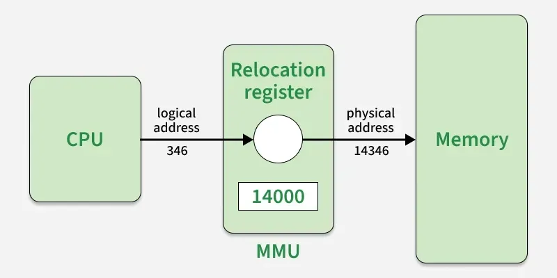

# Logical vs Physical Address Space

Understanding **Logical Address Space** and **Physical Address Space** is fundamental to memory management, paging, segmentation, and placement interview preparation.

---

## 1. What is Address Space?

### Definition

An **address space** is the range of memory addresses that identify memory locations accessible to a process or system.

In modern operating systems, programs do not directly interact with actual RAM addresses.  
Instead, they use **logical addresses**, which the OS and MMU translate to **physical addresses**.

---

## 2. Logical Address Space

### Definition

A **Logical Address** (also called **Virtual Address**) is the address generated by the CPU while executing a process.

### Key Characteristics

- Each process gets its own logical address space
- Logical addresses start from `0` for each process
- Process cannot directly access actual physical memory
- Independent of actual RAM layout

### Example

Process P1 generates logical address `5000`.  
This does not correspond directly to RAM location `5000`.

---

## 3. Physical Address Space

### Definition

A **Physical Address** is the actual address in main memory (RAM) where data is physically stored.

### Key Characteristics

- Physical addresses represent true hardware memory locations
- Memory controller and hardware directly access physical addresses
- Different processes map to different RAM locations
- OS ensures proper isolation and protection

### Example

Physical address `8500` is where a byte actually sits in RAM.

---

## 4. Address Translation Mechanism

The **MMU (Memory Management Unit)** performs address translation:

### Key Points

- Translation happens at runtime for every memory access
- If mapping does not exist in memory, a **page fault** occurs
- OS fetches required data from disk and updates translation table

---

## 5. Logical vs Physical Address Space

| Aspect | Logical Address Space | Physical Address Space |
|------|------------------------|------------------------|
| Generated by | CPU during execution | Memory hardware after MMU translation |
| Visibility | Seen by running process | Seen only by hardware/OS |
| Range | Starts at 0 per process | Depends on installed RAM |
| Address start | Usually 0 for all processes | Varies per physical layout |
| Access control | Indirect (via OS) | Direct hardware access |
| Isolation | Strong (process isolation) | Shared (controlled by OS) |
| Size | Limited by logical address bits | Limited by physical memory |
| Management | By OS + paging/segmentation | By memory controller |

---

## 6. Why Separation is Critical

### Protection

- One process cannot corrupt another process's memory
- Isolation enforced by OS and MMU

### Flexibility

- OS can place process anywhere in RAM
- Process doesn't care about actual location
- Enables memory relocation

### Virtual Memory Support

- Allows processes to use more memory than physically available
- OS can swap data between RAM and disk transparently

### Efficient Resource Utilization

- Memory pages/segments can be shared between processes
- Unused pages can be swapped out
- Supports multiprogramming effectively

---

## 7. How Translation Works (Detailed)

### Example Scenario

Process P1 tries to read byte at **logical address 4300**:

1. CPU generates logical address `4300`
2. MMU looks up translation table entry for address `4300`
3. Finds corresponding page/segment entry pointing to **frame 12**
4. Calculates physical address as **12 * PageSize + Offset** = `12000 + 300` = `12300`
5. Memory controller accesses RAM at physical address `12300`
6. Byte is retrieved and returned to CPU

Process sees logical address; RAM sees physical address.

---

## 8. Real-World Analogy

**Hotel guest room assignment**

- **Guest room number** (logical address) = What guest knows
- **Actual building coordinates** (physical address) = Where building is located
- **Front desk + room mapping system** (MMU) = Translation mechanism
- **Multiple hotels, same room number** = Multiple processes with address 0

---

## 9. Advantages of Logical vs Physical Separation

- **Security:** Memory protection between processes
- **Abstraction:** Processes don't need to know RAM layout
- **Efficiency:** Pages/segments managed independently
- **Portability:** Same program runs on different memory configurations
- **Virtual memory:** Enables demand paging

---

## 10. Disadvantages / Challenges

- **Translation overhead:** Every memory access requires translation
- **TLB needed:** Cache for frequent translations
- **Page table memory:** Extra memory required for mapping
- **Complexity:** OS must manage multiple address spaces

---

## Summary

| Term | Definition | Scope |
|------|-----------|-------|
| Logical Address | Virtual address generated by CPU | Per-process |
| Physical Address | Real RAM address | System-wide |
| MMU | Hardware translator | System component |
| Translation | Logical → Physical mapping | Runtime |

---

## Key Takeaways

- Programs use **logical addresses**, not direct RAM addresses.

- **MMU translates** logical addresses to physical addresses at runtime.

- Separation enables **protection, isolation, and virtual memory**.

- Every memory access goes through translation mechanism.

- This concept is foundational for **paging, segmentation, and advanced memory management**.

---
