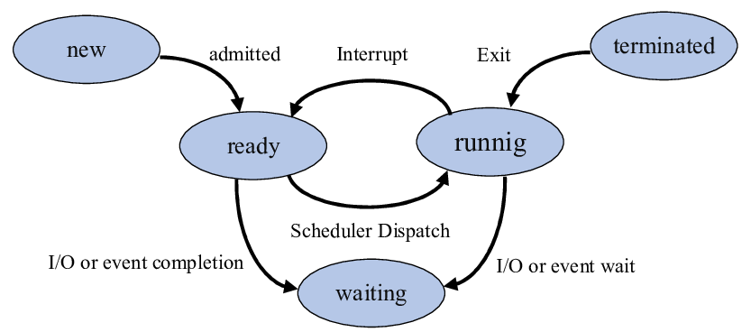

# Processes in Operating Systems  
Understanding processes is fundamental to OS concepts, CPU scheduling, multitasking, memory management, and interview preparation.  

---

## 1. What is a Process?

### Definition

A **Process** is a **program in execution**.  
It is an active entity, unlike a program which is just a passive set of instructions stored on disk.

A process includes:

- Program code (text section)
- Data (global variables)
- Stack (function calls, local variables)
- Heap (dynamic memory)
- CPU context (registers, PC)
- Open files, resources
- Execution state

---

## Components of a Process

1. **Text Section:** Program instructions  

2. **Data Section:** Global/static variables  

3. **Heap:** Dynamically allocated memory  

4. **Stack:** Function calls, local variables  

5. **Registers:** CPU state, program counter  

6. **Process Control Block (PCB):** Metadata maintained by OS

---

## **Process Control Block (PCB)**

A PCB contains all important info about a process:

- Process ID (PID)  
- Process state  
- Program counter  
- CPU registers  
- Memory pointers  
- Scheduling information  
- Accounting info  
- I/O status, open file descriptors  

**Role:**  
Used by OS to **manage and switch** processes during multitasking.

---

## 2. Process States

A process does not run continuously from start to finish.  
It transitions between several well-defined states managed by the OS.

The **standard five-state process model** includes:

---

### 1. New

- The process is being **created**.  
- Memory is allocated and PCB is initialized.

**Examples:**  
Program just launched, loader preparing process structures.

---

### 2. Ready

- Process is **loaded in memory** and ready to run.  
- Waiting for CPU scheduling.  
- Multiple processes may be in ready queue.

**Key Point:**  
It is prepared for execution but CPU is not assigned yet.

---

### 3. Running

- CPU is currently executing the process.  
- Instructions are being processed.

**Events leading to Running:**
- Scheduler selects it from the ready queue.

**Events leading out:**
- Timer interrupt  
- I/O request  
- Completion  

---

### 4. Waiting (or Blocked)

- Process **cannot proceed** until an **event occurs**, such as:
  - I/O completion  
  - Resource availability  
  - Signal/interrupt  

**Example:**  
Process waiting for disk read operation to finish.

---

### 5. Terminated (or Exit)

- Process has **finished execution** or is **force-killed**.  
- OS deallocates memory and removes PCB.

**Examples:**  
Program completed; process killed by OS or user.

---

## 3. Extended Process State Model (7-State Model)

Many OSes use an expanded model:

| State               | Description |
|---------------------|-------------|
| **New**             | Being created |
| **Ready**           | Ready for CPU |
| **Running**         | Currently executing |
| **Blocked/Waiting** | Waiting for event |
| **Suspended Ready** | Process swapped out but ready |
| **Suspended Blocked** | Swapped out while waiting |
| **Terminated**      | Finished |

---

### Suspended States Explained

**Suspended Ready**
- Process is not in main memory (swapped to disk).
- Ready to run but must first be brought into memory.

**Suspended Blocked**
- Process is waiting for an event AND is swapped out to disk.

**Purpose of Suspension:**
- Memory optimization  
- System management  
- Handling long-wait processes  

---

## 4. Process State Transition Diagram

---

## Key Takeaways

- **Process = program in execution**, with its own memory and context.  

- OS manages processes using **PCB**.  

- A process transitions through states: **New → Ready → Running → Waiting → Terminated**.  

- Suspended states handle memory optimization when processes are swapped to disk.  

- Understanding process states is crucial for scheduling, multitasking, and synchronization concepts.

---
