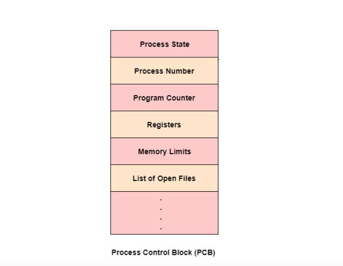

# Process Control Block (PCB)

The **Process Control Block (PCB)** is one of the most important data structures in an operating system.  
It contains **all the essential information** about a process required for its management, scheduling, and execution.

Whenever the CPU switches from one process to another (**context switching**), the OS uses the PCB to **save and restore** the process state.

---

## Definition

A **Process Control Block (PCB)** is a data structure maintained by the operating system to store **information about a process**.  

It acts as a **process descriptor**, holding all metadata required to run, pause, or resume a process.

Every process has its **own PCB**, created when the process starts and destroyed when it terminates.

---

## Why PCB is Needed?

- The CPU cannot run multiple processes simultaneously without saving their states.  

- PCB stores the process state during interrupt handling and scheduling.  

- Allows the OS to **resume a process exactly where it left off**.

In short:  
**PCB enables multitasking**.

---

## Components of PCB

A typical PCB stores the following information:

---

### 1. Process Identification Information

- **PID (Process ID)**  
- **Parent PID**  
- **User/Group ID** (Owner of the process)

---

### 2. Process State

Indicates current status: New, Ready, Running, Waiting, Terminated, etc.

---

### 3. CPU Registers / Context

Saved during context switching:
- Program Counter (PC)  
- General-purpose registers  
- Stack pointer  
- PSW (Program Status Word)

This allows the OS to resume execution correctly.

---

### 4. CPU Scheduling Information

Used by the scheduler:
- Process priority  
- Scheduling queues (ready/waiting)  
- Time slice / quantum  
- CPU usage statistics  

---

### 5. Memory Management Information

Information required to manage process memory:
- Base and limit registers  
- Page tables  
- Segment tables  
- Memory bounds  

---

### 6. Accounting Information

Used for monitoring and billing:
- CPU time consumed  
- Time limits  
- Job numbers  
- Execution time  
- Process start time  

---

### 7. I/O Status Information

Includes:
- List of open files (file descriptors)  
- I/O devices allocated  
- Pending I/O operations  
- Network connections  

---

### 8. Process Resources

Resources allocated to the process:
- Shared memory  
- Message queues  
- Semaphores  

---

## PCB and Context Switching

When a process is interrupted:

1. OS **saves** CPU state into the PCB.  

2. Scheduler selects next process.  

3. OS **loads** the next process’s CPU state from its PCB.  

4. CPU resumes execution.

Thus, PCB is critical for **preemptive multitasking**.

---

## Where is PCB Stored?

- PCBs are stored in **kernel space**, not accessible by user programs.  

- They often reside in a **process table**, a collection of all PCBs in the system.

---

## Key Points to Remember

- PCB uniquely identifies a process.  

- Stores state, registers, scheduling info, memory data, I/O data.  

- Essential for multitasking and context switching.  

- Lives in kernel memory.  

- Destroyed when the process terminates.

---
