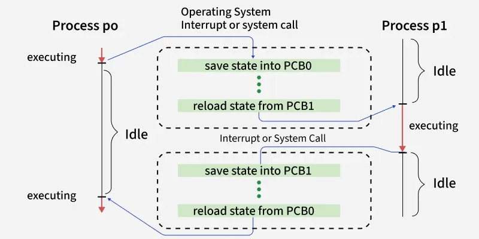

# Context Switching

**Context Switching** is a fundamental concept in multitasking operating systems.  
It allows the CPU to switch from one process (or thread) to another, enabling multiple programs to run "simultaneously" through time-sharing.

---

## Definition

A **Context Switch** is the process of **saving the state** of a currently running process and **restoring the state** of another process so that execution can continue from where it left off.

The “state” refers to:
- CPU registers  
- Program counter  
- Stack pointer  
- Memory mapping info  
- Other PCB-related data  

This state is saved into the **Process Control Block (PCB)**.

---

## Steps in Context Switching

### 1. Save the context of the current process
- CPU registers  
- Program counter  
- Stack pointer  
- Flags (PSW)  
Are stored into **current process’s PCB**.

### 2. Select a new process
- Scheduler chooses a process from the ready queue.

### 3. Load the context of the new process
- OS loads saved register values  
- Restores program counter, stack  
- Updates memory tables  

### 4. Resume execution
- New process continues from the exact point it was paused.

---

## Why Context Switching Occurs?

The OS must switch processes frequently due to:

### 1. Multitasking
To give each process a slice of CPU time.

### 2. I/O Interrupts
Process goes into waiting state for I/O.

### 3. Preemption
High-priority process arrives and preempts the current process.

### 4. System Calls
A user process switches to kernel mode and may block.

### 5. Time Quantum Expiry (Round Robin)
CPU time slice completes and scheduler selects next process.

---

## Context Switching Between Processes vs Threads

| Feature       | Process Switching                              | Thread Switching                                 |
|---------------|-------------------------------------------------|--------------------------------------------------|
| Cost          | High                                            | Low                                              |
| Memory Space  | Requires switching memory context               | Same memory space, lighter switch                |
| Registers     | Full set of registers saved                     | Smaller set saved                                |
| TLB Flush     | Usually required                                | Usually *not* required                           |

**Reason:**  
Threads share the same address space; processes don't.

---

## Types of Context Switching

### 1. Process Context Switch
Switch between two processes with different address spaces.  
Costly due to memory mapping changes and TLB flush.

### 2. Thread Context Switch (Same Process)
Switch inside the same process.  
Cheap and fast.

### 3. Interrupt Context Switch
CPU switches from a process to handle an interrupt.  
Uses an **interrupt vector** instead of PCB.

---

## Overheads in Context Switching

Context switching has costs:

- Saving/restoring registers  
- Switching memory maps  
- TLB (Translation Lookaside Buffer) flushing  
- Kernel-mode transitions  
- Scheduling overhead  

**Context switching is pure overhead**—no actual useful work is done during the switch.

---

## When Context Switching Happens?

| Event                        | Example                                               |
|------------------------------|--------------------------------------------------------|
| **Timer interrupt**          | Time slice ended                                      |
| **I/O interrupt**            | Disk completes read operation                         |
| **System call**              | Read, write, fork, exec                               |
| **Page fault**               | Memory not found in RAM                               |
| **Preemption**               | Higher priority process arrives                       |
| **Blocking**                 | Waiting for keyboard input                            |

---

## Context Switch vs Mode Switch

| Feature         | Context Switch                            | Mode Switch                           |
|-----------------|---------------------------------------------|----------------------------------------|
| **Definition**  | Switch between processes/threads            | Switch between user mode ↔ kernel mode |
| **Cost**        | High                                       | Low                                     |
| **Includes**    | Saving PCB, scheduling, memory mapping     | No scheduling, no PCB change           |
| **Example**     | Round Robin switching                      | System call entry/exit                 |

---

## Summary

- Context switching enables **multitasking**.  

- OS saves the running process’s state into PCB and loads another.  

- Happens due to interrupts, preemption, or I/O waiting.  

- Process-level switching is costly; thread-level switching is cheaper.  

- Reducing context switches improves performance.

---
