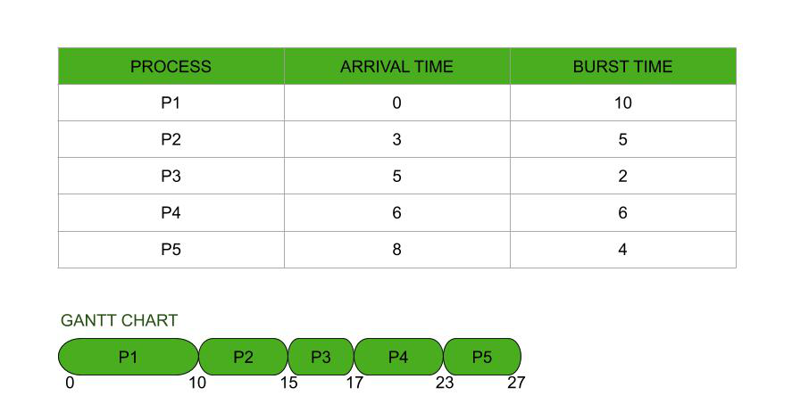

# First Come First Serve (FCFS)

**First Come First Serve (FCFS)** is the **simplest CPU scheduling algorithm**, where the process that **arrives first in the ready queue is executed first**.  

It follows a **non-preemptive** scheduling approach and is mainly used in **batch systems**.

---

## 1. What is FCFS Scheduling?

### Definition
In **FCFS scheduling**, processes are scheduled **in the exact order of their arrival**.

> CPU allocation is based purely on arrival time, without considering burst time or priority.

---

## 2. Key Characteristics of FCFS

- **Non-preemptive** scheduling
- Uses **FIFO (First-In-First-Out)** principle
- Simple to implement
- No starvation (every process gets CPU eventually)
- Can cause **poor performance**

---

## 3. How FCFS Works

1. Processes enter the **ready queue** in arrival order.

2. CPU is allocated to the **first process** in the queue.

3. Process executes until:
   - it completes, or
   - it blocks for I/O

4. Next process in queue gets the CPU.

---

## 4. FCFS Example

### Given Processes

| Process | Arrival Time | Burst Time |
|--------|--------------|------------|
| P1 | 0 | 5 |
| P2 | 1 | 3 |
| P3 | 2 | 8 |

---

### Step 1: Order by Arrival Time

```
P1 → P2 → P3
```

---

### Step 2: Gantt Chart

```
| P1 | P2 | P3 |
0    5    8    16
```

---

### Step 3: Calculate Completion Time (CT)

| Process | CT |
|--------|----|
| P1 | 5 |
| P2 | 8 |
| P3 | 16 |

---

### Step 4: Turnaround Time (TAT)

```
TAT = CT − Arrival Time
```

| Process | CT | TAT |
|--------|----|-----|
| P1 | 5 | 5 − 0 = 5 |
| P2 | 8 | 8 − 1 = 7 |
| P3 | 16 | 16 − 2 = 14 |

---

### Step 5: Waiting Time (WT)

```
WT = TAT − Burst Time
```

| Process | TAT | BT | WT |
|--------|-----|------------|----|
| P1 | 5 | 5 | 5 − 5 = 0 |
| P2 | 7 | 3 | 7 − 3 = 4 |
| P3 | 14 | 8 | 14 − 8 = 6 |

---

### Step 6: Average Times

```
Average Waiting Time = (0 + 4 + 6) / 3 = 3.33
Average Turnaround Time = (5 + 7 + 14) / 3 = 8.67
```

---

## 5. FCFS Scheduling Diagram (Sample)



---

## 6. Convoy Effect (Major Problem in FCFS)

### What is Convoy Effect?

A situation where:
- One **long CPU-bound process**
- Blocks several **short I/O-bound processes**

---

### Example

| Process | Burst Time |
|--------|------------|
| P1 | 20 |
| P2 | 2 |
| P3 | 2 |

Gantt Chart:

```
| P1 | P2 | P3 |
0    20   22   24
```

Short processes wait unnecessarily → **poor CPU utilization and response time**.

---

## 7 Advantages vs Disadvantages

| Advantages | Disadvantages |
|------------|----------------|
| Simple to implement | Poor average waiting time |
| No starvation | Convoy effect |
| Fair (by arrival time) | Not suitable for interactive systems |
| Easy to understand | Long processes delay short ones |

---

## 8. Where FCFS is Used

- Batch processing systems
- Simple OS designs
- Early operating systems
- When simplicity > performance

---

## Key Takeaways

- FCFS schedules processes strictly by arrival order  

- Easy but inefficient for modern systems  

- Suffers from convoy effect  

- Best suited for batch jobs, not interactive systems  

---
