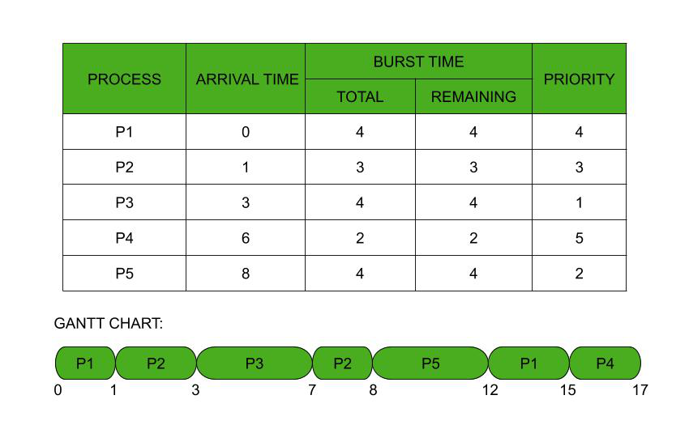

# Priority Scheduling

**Priority Scheduling** is a CPU scheduling algorithm in which **each process is assigned a priority**, and the CPU is allocated to the process with the **highest priority**.

> Priority scheduling ensures that **more important processes get CPU access before less important ones**.

It can be implemented in **both preemptive and non-preemptive** forms.



---

## 1. What is Priority Scheduling?

### Definition
In **Priority Scheduling**, the CPU is assigned to the process with the **highest priority value** among all processes in the ready queue.

- Priority may be:
  
  - **lower number = higher priority**, or
  
  - **higher number = higher priority** (system dependent)

---

## 2. Types of Priority Scheduling

### 2.1 Non-Preemptive Priority Scheduling
- Once a process gets CPU, it runs **until completion or I/O wait**
- Priority is checked **only when CPU becomes idle**

---

### 2.2 Preemptive Priority Scheduling
- A running process can be **preempted** if a higher-priority process arrives
- Improves response for critical processes
- Used in real-time and interactive systems

---

## 3. How Priority Scheduling Works

1. Each process is assigned a priority

2. Scheduler selects the process with the **highest priority**

3. In case of tie:
   - FCFS is usually used

4. CPU is allocated based on preemptive or non-preemptive mode

---

## 4. Priority Scheduling Example (Non-Preemptive)

### Given Processes  
*(Lower number = higher priority)*

| Process | Arrival Time | Burst Time | Priority |
|--------|--------------|------------|----------|
| P1 | 0 | 10 | 3 |
| P2 | 1 | 1 | 1 |
| P3 | 2 | 2 | 4 |
| P4 | 3 | 1 | 2 |

---

### Step 1: Order by Priority

At time 0, only P1 available → executes

After P1 completes, all others available → choose highest priority

Execution order:

```
P1 → P2 → P4 → P3
```

---

### Step 2: Gantt Chart

```
| P1 | P2 | P4 | P3 |
0    10   11   12   14
```

---

### Step 3: Completion Time (CT)

| Process | AT | BT | Priority | CT |
|--------|----|----|----------|----|
| P1 | 0 | 10 | 3 | 10 |
| P2 | 1 | 1 | 1 | 11 |
| P4 | 3 | 1 | 2 | 12 |
| P3 | 2 | 2 | 4 | 14 |

---

### Step 4: Turnaround Time (TAT)

```
TAT = CT − Arrival Time
```

| Process | AT | CT | TAT |
|--------|----|----|-----|
| P1 | 0 | 10 | 10 − 0 = 10 |
| P2 | 1 | 11 | 11 − 1 = 10 |
| P4 | 3 | 12 | 12 − 3 = 9 |
| P3 | 2 | 14 | 14 − 2 = 12 |

---

### Step 5: Waiting Time (WT)

```
WT = TAT − Burst Time
```

| Process | AT | BT | TAT | WT |
|--------|----|----|-----|----|
| P1 | 0 | 10 | 10 | 10 − 10 = 0 |
| P2 | 1 | 1 | 10 | 10 − 1 = 9 |
| P4 | 3 | 1 | 9 | | 9 − 1 = 8 |
| P3 | 2 | 2 | 12 | 12 − 2 = 10 |

---

## 5. Starvation – Major Problem

### What is Starvation?
Low-priority processes may **never get CPU time** if high-priority processes keep arriving.

---

### Solution: Aging

**Aging** gradually increases the priority of a waiting process over time, ensuring fairness.

---

## 6. Priority Scheduling in Practice

- Used in **real-time systems**

- OS assigns priority based on:
  - importance
  - CPU usage
  - memory requirements

- System processes usually have **higher priority**

---

## 7. Advantages vs Disadvantages

| Advantages | Disadvantages |
|------------|---------------|
| Efficient for important tasks | Starvation risk |
| Flexible (preemptive/non-preemptive) | Complexity in priority assignment |
| Better response for critical processes | Overhead in context switching | 
| Widely used in real-time systems | Difficult to predict performance | 

--- 

## Key Takeaways

- Priority Scheduling selects processes based on importance  

- Supports both preemptive and non-preemptive modes  

- Starvation is the biggest issue  

- Aging improves fairness  

- Widely used in real-world OS kernels  

---