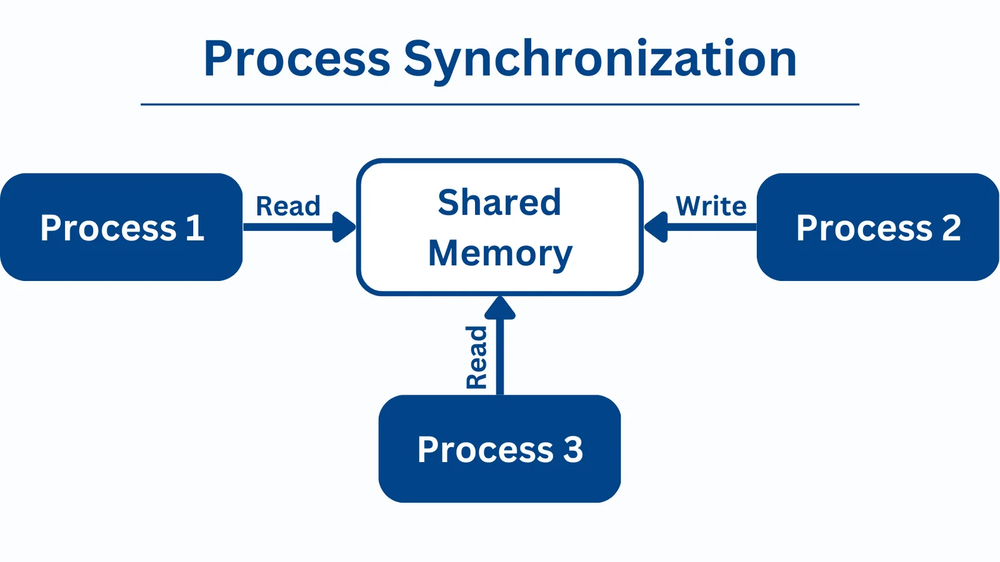

# Why Synchronization Exists

**Synchronization** exists in Operating Systems to ensure **correct, consistent, and predictable execution** when **multiple processes or threads execute concurrently** and **share resources**.

Without synchronization, concurrent execution can lead to **data inconsistency, race conditions, and system instability**.



---

## 1. The Core Problem: Concurrency

Modern operating systems support:
- **Multitasking** (multiple processes)
- **Multithreading** (multiple threads within a process)
- **Multiprocessor / multicore systems**

This means:
- Multiple execution units can run **at the same time**
- They may **access shared data or resources simultaneously**

Concurrency improves performance, but it introduces **coordination problems**.

---

## 2. Shared Resources and Critical Sections

### Shared Resources
Resources that can be accessed by multiple processes/threads:
- Variables in shared memory
- Files
- Databases
- Printers
- I/O buffers

### Critical Section
A **critical section** is a part of code where a process:
> Accesses or modifies shared resources.

If two processes enter a critical section simultaneously → **incorrect results**.

---

## 3. Race Condition (Main Reason for Synchronization)

### Definition
A **race condition** occurs when:
> The output of a program depends on the **timing or interleaving** of concurrent executions.

---

### Example (Without Synchronization)

Shared variable:
```
count = 5
```

Two threads execute:
```
count = count + 1
```

Possible execution:
- Thread A reads count = 5
- Thread B reads count = 5
- Thread A writes count = 6
- Thread B writes count = 6

Correct result should be **7**, but result is **6**.

This happens due to **unsynchronized access**.

---

## 4. Why the OS Cannot Ignore Synchronization

If synchronization is not enforced:
- Data corruption occurs
- Programs behave unpredictably
- Bugs become **non-deterministic** (hard to reproduce)
- System reliability decreases

Therefore, synchronization is **mandatory**, not optional.

---

## 5. Goals of Synchronization

Synchronization ensures:

1. **Mutual Exclusion**
   - Only one process enters critical section at a time

2. **Consistency**
   - Shared data remains correct

3. **Orderly Execution**
   - Certain operations occur in the correct sequence

4. **Coordination**
   - Producer-consumer, reader-writer problems

---

## 6. Synchronization in Single-Core vs Multi-Core Systems

### Single-Core Systems
- Concurrency via **context switching**
- Interrupts can cause race conditions

### Multi-Core Systems
- True parallel execution
- Even higher chance of simultaneous access
- Synchronization is **critical**

---

## 7. Synchronization vs Scheduling

| Aspect | Scheduling | Synchronization |
|------|------------|-----------------|
| Purpose | Decide who runs | Control shared access |
| Focus | CPU allocation | Data correctness |
| Problem solved | Fairness, performance | Race conditions |

Both are required for a correct OS.

---

## 8. Problems Solved by Synchronization

- Race conditions
- Inconsistent shared data
- Lost updates
- Improper sequencing
- Deadlocks (when designed correctly)

---

## 9. Real-World Analogy

**Traffic Signals**

- Cars = processes
- Intersection = critical section
- Signal = synchronization mechanism

Without signals → accidents (data corruption)

---

## 10. Where Synchronization is Used

- Multithreaded applications
- Operating system kernels
- Databases
- File systems
- Distributed systems

---

## Summary

| Aspect | Explanation |
|------|-------------|
| Root cause | Concurrent access to shared resources |
| Main problem | Race condition |
| Purpose | Ensure correctness & consistency |
| Without sync | Unpredictable behavior |

---

## Key Takeaways

- Synchronization exists because **concurrency is unavoidable**

- Shared resources require **controlled access**

- Prevents race conditions and data inconsistency

- Essential for reliable and correct system behavior

- Foundation for mutexes, semaphores, monitors, etc.

---
