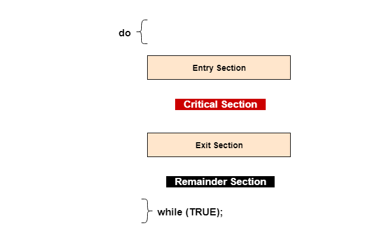

# Critical Section Problem

The **Critical Section** is a fundamental concept in **process synchronization**.  

It represents the part of a program where **shared resources are accessed or modified**, and therefore **must not be executed by more than one process or thread at the same time**.

Understanding the critical section is essential to prevent **race conditions**, **data inconsistency**, and **unpredictable behavior** in concurrent systems.

---

## 1. What is a Critical Section?

### Definition
A **Critical Section** is a segment of code in which a process:
> Accesses shared data or shared resources that must be executed in a **mutually exclusive** manner.

If two or more processes enter the critical section simultaneously, it can lead to incorrect results.

---

## 2. Structure of a Program with Critical Section

A typical process structure:



---

## 3. Example of a Critical Section

Shared variable:
```
int count = 0;
```

Critical section code:
```
count = count + 1;
```

This operation involves:
1. Reading `count`

2. Incrementing value

3. Writing back to memory

If multiple threads execute this simultaneously → **race condition occurs**.

---

## 4. Why Critical Section is Needed

Without critical section control:
- Multiple processes access shared data concurrently
- Race conditions occur
- Data inconsistency arises
- Results become unpredictable

Thus, controlling entry to the critical section is **mandatory**.

---

## 5. Critical Section Problem

### Definition
The **Critical Section Problem** is the task of designing a protocol that ensures:
> When one process is executing its critical section, **no other process is allowed to execute its critical section**.

---

## 6. Requirements of a Correct Critical Section Solution

A solution to the critical section problem must satisfy **all three conditions**:

---

### 6.1 Mutual Exclusion
- Only **one process** can be in the critical section at any time

---

### 6.2 Progress
- If no process is in the critical section:
  - The decision of which process enters next **cannot be postponed indefinitely**

---

### 6.3 Bounded Waiting
- There exists a **limit on the number of times** other processes can enter the critical section after a process has requested entry

This prevents **starvation**.

---

## 7. Entry Section and Exit Section

### Entry Section
- Code that requests permission to enter the critical section
- Implements synchronization logic

### Exit Section
- Code that releases the permission
- Allows other waiting processes to proceed

---

## 8. Types of Critical Sections

### 8.1 Process-Level Critical Section
- Between multiple processes
- Requires OS-level synchronization (semaphores, mutexes)

### 8.2 Thread-Level Critical Section
- Between threads of same process
- Often uses mutex locks or monitors

---

## 9. Hardware vs Software Solutions

### Hardware-Based
- Disable interrupts
- Atomic instructions (Test-and-Set, Compare-and-Swap)

### Software-Based
- Peterson’s solution
- Semaphores
- Mutex locks
- Monitors

---

## 10. Critical Section vs Remainder Section

| Aspect | Critical Section | Remainder Section |
|------|------------------|------------------|
| Shared data access | Yes | No |
| Synchronization needed | Yes | No |
| Risk of race condition | High | None |

---

## 11. Real-World Analogy

**Single-lane bridge**

- Bridge = critical section
- Cars = processes
- Traffic signal = synchronization mechanism

Only one car can cross at a time to avoid collision.

---

## Summary

| Concept | Description |
|------|-------------|
| Critical Section | Code accessing shared resources |
| Main Problem | Race conditions |
| Solution Goal | Mutual exclusion |
| Requirements | Mutual exclusion, progress, bounded waiting |

---

## Key Takeaways

- Critical section protects **shared resources**

- Only one process can execute it at a time

- Improper handling leads to **race conditions**

- Correct solutions must satisfy **three conditions**

- Foundation for all synchronization mechanisms

---
